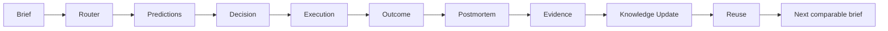

# r352 Genome OS

## Kanoniczna specyfikacja produktu, systemu i operacji

- **Wersja dokumentu:** 1.0
- **Data stanu:** 2026-08-09
- **Właściciel produktu:** Przemek / r352
- **Status produktu:** wczesny prototyp wewnętrzny, faza walidacji
- **Zakres:** opis produktu, architektura logiczna i techniczna, model danych, UX, governance, operacje, pomiar, walidacja i kierunek rozwoju
- **Źródła prawdy:** `r352-os/genome/` oraz generowane `r352-os/genome/dist/`
- **Rola tego dokumentu:** mapa systemu i kontrakt produktu; nie jest źródłem bieżących liczników ani confidence

---

## 0. Jak czytać ten dokument

Genome OS jest równocześnie ideą operacyjną, protokołem pracy, zbiorem danych, zestawem procesów wykonywanych przez AI i lokalnym interfejsem. Żeby nie mieszać stanu istniejącego z planem, dokument używa czterech oznaczeń:

| Oznaczenie | Znaczenie |
|---|---|
| **CURRENT** | Istnieje w repozytorium i jest częścią obecnego systemu. |
| **PILOT** | Istnieje częściowo albo działa w ograniczonym przebiegu testowym. |
| **NEXT** | Najbliższy uzasadniony krok, ale nie wolno przedstawiać go jako działającej funkcji. |
| **LATER** | Hipoteza długoterminowa, wymagająca wcześniejszych dowodów i osobnej decyzji. |

W przypadku rozbieżności obowiązuje kolejność:

1. fakty zapisane w Ledgerze,
2. kanoniczne obiekty w `r352-os/genome/`,
3. wyniki generowane przez `build.js`,
4. decyzje w `genome/decisions/`,
5. niniejsza specyfikacja,
6. dokumenty historyczne i analityczne,
7. interfejs oraz jego ręcznie przygotowane dane operacyjne.

Dokument nie może samodzielnie zmieniać statusu mechanizmu, confidence ani historii projektu. Taka zmiana wymaga faktu, evidence i zdarzenia w Ledgerze.

---

# Część I. Definicja produktu

## 1. Jedno zdanie

**Genome OS to protokół uczenia się r352, który zamienia historię decyzji, przewidywań, wyników i dowodów z projektów w lepsze decyzje w kolejnych porównywalnych projektach.**

## 2. Najważniejsze rozróżnienie

Genome nie jest przede wszystkim aplikacją.

- **Genome jako produkt wewnętrzny** to zdolność organizacji do uczenia się.
- **Protokół Genome** określa, co dzieje się przed projektem, podczas decyzji i po wyniku.
- **Dane Genome** przechowują wiedzę oraz fakty potrzebne do odtworzenia rozumowania.
- **Silniki Genome** wybierają, rekomendują, wykonują i aktualizują wiedzę.
- **Aplikacja Genome OS** jest wymienialnym interfejsem obniżającym koszt korzystania z protokołu.

Wartość nie powstaje przez samo zapisanie lekcji. Powstaje dopiero wtedy, gdy lekcja zostaje znaleziona i wykorzystana w kolejnej decyzji.

```text
Lesson created
    -> Lesson reused
        -> Decision changed
            -> Outcome improved or risk avoided
```

## 3. Problem

Firmy przechowują dokumenty, pliki, prezentacje i rozmowy, ale zwykle nie przechowują w użytecznej formie:

- kontekstu decyzji,
- rozważanych alternatyw,
- powodów wyboru,
- przewidywań zapisanych przed wynikiem,
- rzeczywistych skutków,
- warunków, w których metoda zadziałała,
- warunków, w których metoda zawiodła,
- informacji, czy lekcja została później użyta.

Skutkiem jest organizacyjna amnezja:

- podobne problemy są diagnozowane od początku,
- te same błędy wracają,
- jakość zależy od pamięci właściciela,
- delegacja wymaga ciągłego dopowiadania kontekstu,
- AI generuje szybciej, ale niekoniecznie podejmuje lepsze decyzje,
- rosnąca liczba artefaktów nie zwiększa proporcjonalnie zdolności firmy.

Genome ma zamienić doświadczenie rozproszone w pracy w **Organizational Decision Memory**: pamięć decyzji organizacji z prowieniencją, wynikiem i możliwością ponownego użycia.

## 4. Teza produktu

AI obniża koszt produkcji kreatywnej. Wąskim gardłem staje się dobór właściwego problemu, mechanizmu, granic, kryteriów jakości i momentu ludzkiej decyzji.

Genome zakłada, że firma może budować przewagę, jeśli systematycznie:

1. rejestruje decyzje i przewidywania przed wynikiem,
2. porównuje je z rzeczywistością,
3. aktualizuje wiedzę wyłącznie przez dowody,
4. automatycznie ładuje tę wiedzę przy następnym podobnym problemie,
5. mierzy, czy ponowne użycie poprawiło decyzję.

Teza jest nadal walidowana. Nie wolno traktować jej jako udowodnionego wyniku biznesowego.

## 5. Użytkownicy

### 5.1 Użytkownik główny — CURRENT

Przemek jako właściciel r352 i główny decydent.

Potrzebuje odpowiedzi na pytania:

- Co jest teraz najważniejsze i dlaczego?
- Czy rozwiązywaliśmy podobny problem?
- Które mechanizmy pasują do tego briefu?
- Kiedy danego mechanizmu nie stosować?
- Jakie ryzyko widzieliśmy wcześniej?
- Co przewidujemy przed realizacją?
- Gdzie Router się pomylił?
- Czego nauczył nas projekt?
- Gdzie ta lekcja zostanie ponownie użyta?

### 5.2 Użytkownicy wykonawczy — PILOT

- sesje AI wykonujące routing, analizę, egzekucję i postmortem,
- podwykonawcy korzystający z SOP-ów, workflowów i guardów,
- współpracownicy potrzebujący kontekstu bez rekonstrukcji historii z pamięci właściciela.

### 5.3 Użytkownik zewnętrzny — LATER

Organizacja marketingowa lub kreatywna, która chce zarządzać jakością decyzji i autonomią AI. Ten segment nie jest jeszcze zatwierdzonym rynkiem produktu. Wymaga dowodów wewnętrznych, dwóch niezależnych klientów-laboratoriów i mierzalnego baseline -> delta.

## 6. Jobs to be Done

### Przed projektem

> Gdy pojawia się nowy brief, chcę szybko ustalić prawdziwy problem, odszukać wcześniejsze doświadczenie i wybrać mechanizmy, żebym nie zaczynał od produkcji ani od zera.

### Przy decyzji

> Gdy istnieje kilka możliwych dróg, chcę zobaczyć kontekst, dowody, ryzyka i przewidywane konsekwencje, żebym mógł podjąć świadomą decyzję i później ocenić jej jakość.

### Po projekcie

> Gdy znany jest wynik, chcę porównać go z wcześniejszymi przewidywaniami i wyłonić najwyżej kilka lekcji, żebym zmienił przyszłe zachowanie zamiast tylko stworzyć raport.

### Przy następnym podobnym projekcie

> Gdy wraca podobny problem, chcę automatycznie otrzymać właściwą lekcję z kontekstem i dowodem, żebym nie zapłacił za nią drugi raz.

## 7. Obietnica wewnętrzna

Genome ma zwiększać prawdopodobieństwo, że porównywalny kolejny projekt będzie:

- szybciej właściwie zdiagnozowany,
- rozpoczęty z lepszym zestawem mechanizmów,
- obciążony mniejszą liczbą powtórzonych błędów,
- zakończony mniejszą liczbą niepotrzebnych iteracji,
- łatwiejszy do delegowania,
- lepiej udokumentowany dowodowo,
- bardziej przewidywalny ekonomicznie.

Nie obiecujemy, że każdy kolejny projekt będzie bezwzględnie lepszy od poprzedniego. Projekty różnią się klasą, trudnością i warunkami. Porównanie musi odbywać się w obrębie sensownie podobnych klas.

## 8. Non-goals obecnego etapu

Genome OS nie jest teraz:

- publicznym SaaS-em,
- systemem wieloużytkownikowym,
- CRM-em,
- narzędziem do zarządzania zadaniami,
- repozytorium wszystkich plików firmy,
- autonomicznym CEO,
- pełnym silnikiem symulacji przyszłości,
- zamiennikiem odpowiedzialności człowieka,
- platformą wymagającą backendu, auth i realtime,
- pretekstem do kolejnego redesignu,
- miarą wartości opartą na liczbie dokumentów lub agentów.

---

# Część II. Zasady produktu

## 9. Konstytucja operacyjna

### 9.1 Decision over document

Dokument jest nośnikiem. Jednostką wartości jest:

```text
Context + Decision + Prediction + Outcome + Evidence + Learning + Reuse
```

### 9.2 Evidence over opinion

Narracja może być wskazówką, ale nie może sama nadać statusu `validated`. Aktualizacja wiedzy wymaga evidence ze źródłem.

### 9.3 Compression over storage

Pełne materiały mogą pozostać w archiwum lub Recordzie. Do aktywnej wiedzy powinno awansować najwyżej kilka lekcji, które zmieniają przyszłe zachowanie.

### 9.4 Reuse over documentation

Lekcja bez kanału ponownego użycia jest martwą dokumentacją. Każda promowana lekcja powinna wskazywać, gdzie i w jakim triggerze wróci do pracy.

### 9.5 One source of truth

Kanoniczne obiekty istnieją w `r352-os/genome/`. Interfejs, indeksy i grafy są widokami generowanymi. Ręczne kopie danych kanonicznych są długiem i nie mogą definiować stanu systemu.

### 9.6 Facts are append-only

Faktów nie poprawia się w miejscu. Błąd koryguje nowe zdarzenie wskazujące fakt unieważniony albo zastąpiony.

### 9.7 Human authority at irreversible boundaries

AI może analizować, zawężać i rekomendować. Człowiek zatwierdza decyzje odwagi, zobowiązania finansowe, komunikację zewnętrzną, promocję do produkcji i zmiany o wysokiej nieodwracalności.

### 9.8 Falsification before expansion

Nowa architektura wymaga potrzeby wykazanej danymi. Usunięcie połowy mechanizmów po walidacji jest sukcesem, jeśli zwiększa zaufanie do pozostałych.

### 9.9 The system must forget

Wiedza bez świeżego potwierdzenia nie zachowuje wiecznej pewności. System musi wspierać obniżenie confidence, `disproven`, `deprecated`, korektę i w przyszłości decay.

### 9.10 No silent intelligence

Każda rekomendacja powinna dać się odtworzyć: z jakich kart, dowodów, reguł i faktów wynikała. Model AI jest wymienialnym wykonawcą, nie źródłem prawdy.

## 10. Aksjomaty CURRENT

System posiada osiem zaakceptowanych aksjomatów:

1. AI automatyzuje decyzje o niskiej wartości poznawczej.
2. Dowód wyprzedza obietnicę.
3. Prawda ma jedno źródło.
4. Za każdą lekcję płacimy raz.
5. Mechanizm jest ważniejszy niż artefakt.
6. Każdy projekt ujawnia mechanizmy.
7. Największą przewagą jest tempo uczenia się.
8. Organizacje uczą się przez decyzje, nie dokumenty.

## 11. Zasady CURRENT

Siedem aktywnych Principles organizuje mechanizmy:

- Design for Machine Readers,
- Extract, Never Invent,
- Pay for Every Lesson Once,
- Proof Before Promise,
- Reduce Subjectivity,
- Single Source of Truth,
- Trust Through Boundaries.

---

# Część III. Stan produktu

## 12. Snapshot CURRENT

Stan generowany na podstawie repozytorium:

| Element | Stan |
|---|---:|
| Obiekty kanoniczne rozpoznawane przez bieżący build check | 187 |
| Zdarzenia w Ledgerze | 82 |
| Aksjomaty | 8 |
| Principles | 7 |
| Mechanizmy | 24 |
| Mechanizmy `emerging` | 22 |
| Mechanizmy `hypothesis` | 2 |
| Mechanizmy `validated` | 0 |
| Eksperymenty | 22 proposed |
| Projekty | 50 |
| Projekty aktywne | 2 |
| Triale zakończone | 0 / 3 |
| Triale aktywne | #001 ARToffNIA, #002 marka tłumacza |
| Rekordy routingu, backtestów i reviews | 42 łącznie |
| Decyzje | 6 |
| Guardy | 1 proposed |
| Workflowy kanoniczne | 0 |
| SOP-y kanoniczne | 0 |
| Sygnały kanoniczne | 0 |

Weryfikacja techniczna obecnego zbioru kończy się wynikiem `0 błędów, 0 ostrzeżeń`. W momencie aktualizacji dokumentu źródła zawierają 187 obiektów, natomiast ostatni wyemitowany `dist/INDEX.md` nadal pokazuje 171. Oznacza to zaległy pełny build wyjść, nie utratę obiektów.

## 13. Co istnieje

### CURRENT

- zaimplementowana ontologia 17 typów plikowych oraz trzech klas faktów Ledgera,
- pliki Markdown z YAML frontmatter,
- append-only Ledger w JSONL,
- deterministyczny `build.js`,
- generowany indeks, metryki i graf,
- 24 karty mechanizmów,
- Router jako skill i protokół,
- project postmortem jako capability,
- dwa aktywne triale,
- program minimum 30 backtestów historycznych,
- pierwsza transza 11 backtestów,
- lokalny viewer `genome-os`,
- wyszukiwarka obiektów,
- ekran Dziś, Router, Genome, Projekty, Graf, Eksperymenty, Klienci i CTO,
- poranny agent CKO,
- reguła buildowania po każdej zmianie Genome.

### PILOT

- pełna pętla żywego trialu,
- zmiany wiedzy na podstawie realnych wyników,
- Router accuracy loop,
- Learning Velocity,
- workflow ponownego użycia lekcji,
- Client Genome,
- operacyjne wykorzystanie Decision Engine,
- zamknięcie eksperymentów.

### Jawny dług CURRENT

1. Viewer korzysta z dwóch warstw danych: kanonicznego `GENOME_DATA` i starszego `GENOMEOS_DATA`.
2. Ręczna warstwa UI nadal zawiera historyczne `proven`, mimo że kanon używa `validated`.
3. Ręczne dane UI pokazują 22 mechanizmy, a kanon ma 24.
4. Część ścieżek w UI wskazuje dawne `genome/routing/` zamiast `genome/records/routing/`.
5. `README.md` opisuje uproszczoną strukturę v1, nie pełną strukturę F0.
6. Najważniejsze metryki skutku, średnia iteracji i czas brief -> decyzja pozostają `n/d`.
7. Wszystkie eksperymenty są proposed; żaden nie jest resolved.
8. Guard build-check jest proposed, nieuzbrojony jako pre-commit lub CI.
9. Workflowy, SOP-y i Signals istnieją w ontologii, ale nie mają jeszcze kanonicznych obiektów.
10. UI nie posiada pełnego kontraktu responsywnego dla małych ekranów.
11. Dane operacyjne viewera mogą zawierać informacje prywatne i nie nadają się do publicznego deployu.
12. `dist/METRICS.md` pokazuje `15 / 22` mechanizmy z mocnym Evidence, podczas gdy katalog kanoniczny ma już 24 mechanizmy; znaczenie mianownika wymaga ujednolicenia albo jawnego opisania jako kohorty bazowej.
13. `build.js --check` rozpoznaje 187 obiektów, ale ostatni pełny emit `dist/INDEX.md` zawiera 171; wygenerowane widoki są opóźnione względem źródeł.

---

# Część IV. Architektura logiczna

## 14. Odpowiedzialności systemu

Genome OS można opisać jako siedem logicznych odpowiedzialności. Nie wszystkie są osobnymi aplikacjami ani procesami.

### 14.1 Genome — CURRENT

Przechowuje wiedzę:

- aksjomaty,
- zasady,
- mechanizmy,
- reguły,
- workflowy i SOP-y,
- capability,
- komponenty,
- benchmarki,
- kontekst klientów.

Nie rejestruje historii przez nadpisywanie. Historia wynika z wersji i zdarzeń.

### 14.2 Ledger — CURRENT

Przechowuje fakty append-only:

- decyzje,
- zdarzenia,
- evidence,
- przewidywania,
- rozstrzygnięcia,
- zmiany confidence,
- korekty wiedzy,
- zmiany ontologii,
- zdarzenia projektu i eksperymentu.

Ledger jest podstawą audytowalności, trajektorii oraz przyszłych metryk uczenia.

### 14.3 Router — CURRENT/PILOT

Analizuje brief przed egzekucją. Powinien:

1. nazwać rzeczywisty problem,
2. sklasyfikować organizację i klasę projektu,
3. sprawdzić, czy rozwiązanie lub standard już istnieje,
4. wykonać adekwatny benchmarking,
5. dobrać 3-7 mechanizmów,
6. odrzucić mechanizmy pasujące do anti-context,
7. dobrać capability, agentów, workflow i bramki,
8. nazwać ryzyka,
9. zarejestrować falsyfikowalne przewidywania,
10. wskazać sposób pomiaru.

### 14.4 Decision Engine — PILOT

Przygotowuje rekomendacje, priorytety, azymut i opcje. Nie podejmuje za człowieka decyzji nieodwracalnych. Jego jakość ocenia się przez:

- przyjęcie lub odrzucenie rekomendacji,
- powód ludzkiej decyzji,
- wynik,
- trafność wcześniejszego przewidywania,
- kalibrację po czasie.

### 14.5 Execution Engine / Foundry — CURRENT jako praktyka

Realizuje pracę przez:

- sesje AI,
- skille,
- podwykonawców,
- skrypty,
- komponenty,
- integracje,
- sandboxy i guardy.

Wiedza i rekomendacja nie są wykonaniem. Każda rekomendacja powinna mieć właściciela lub mechanizm egzekucji.

### 14.6 Learning Engine — PILOT

Po wyniku:

- rozlicza przewidywania,
- ocenia trafność Routera,
- zbiera evidence,
- aktualizuje lub falsyfikuje mechanizmy,
- promuje najwyżej kilka lekcji,
- wykrywa nowe hipotezy,
- wskazuje kanał ponownego użycia.

### 14.7 Viewer / Pulse — CURRENT

Viewer jest powierzchnią interakcji, a nie źródłem wiedzy. Ma odpowiadać na pytania i wspierać działanie. Dane kanoniczne powinny być generowane. Dane operacyjne powinny być jawnie oddzielone.

## 15. Kontekst systemowy

```mermaid
flowchart LR
    EXT["Gmail / Slack / Trello / pliki / Git / Figma"] --> SIG["Sygnały i briefy"]
    SIG --> ROUTER["Router"]
    GENOME["Genome: wiedza"] --> ROUTER
    ROUTER --> DEC["Rekomendacja i decyzja człowieka"]
    DEC --> EXEC["Execution Engine"]
    EXEC --> OUT["Rezultat w rzeczywistości"]
    OUT --> LEARN["Postmortem / Learning Engine"]
    LEARN --> LEDGER["Ledger: fakty i evidence"]
    LEDGER --> GENOME
    GENOME --> BUILD["Deterministyczny build"]
    BUILD --> UI["Genome OS Viewer"]
```



## 16. Główna pętla



## 17. Pętla prawdy

```text
Event
  -> Evidence with provenance
    -> Knowledge proposal
      -> Decision or governed transition
        -> Knowledge update
          -> generated views
```

Zakazane skróty:

- opinia -> validated,
- narracja -> measurement,
- edycja statusu -> brak eventu,
- wynik znany -> predykcja dopisana wstecz,
- wygenerowany ekran -> źródło prawdy.

---

# Część V. Model domenowy

## 18. Dwie natury danych

### Wiedza mutable, wersjonowana

Opisuje, co system wie i umie. Może się zmieniać, ale każda zmiana musi pozostawić ślad.

### Fakty immutable, append-only

Opisują, co się wydarzyło. Nie są poprawiane po cichu. Korekta jest nowym faktem.

## 19. Katalog obiektów i rozbieżność liczby typów

Dokument Data Foundation nazywa katalog „19 obiektów”, ale wymienia 20 pojęć domenowych. Implementacja `build.js` rozpoznaje 17 typów obiektów plikowych, natomiast `Prediction`, `Evidence` i `Event` żyją w Ledgerze jako klasy faktów. Daje to łącznie 20 logicznych pojęć systemu.

Ta różnica jest długiem definicyjnym, nie błędem danych runtime. Do czasu osobnej decyzji nie należy zmieniać ontologii tylko po to, żeby zgadzała się liczba w nagłówku. Poniższa tabela opisuje wszystkie 20 pojęć używanych przez aktualną specyfikację domeny.

| Obiekt | Natura | Rola | Typowy właściciel | Cykl życia |
|---|---|---|---|---|
| Axiom | wiedza | fundamentalne prawo systemu | Przemek | draft -> accepted -> deprecated |
| Principle | wiedza | zasada grupująca mechanizmy | Przemek | draft -> active -> deprecated |
| Mechanism | wiedza | powtarzalny generator rezultatu | sesja + Przemek | hypothesis -> emerging -> validated / disproven / deprecated |
| Workflow | wiedza | sekwencja mechanizmów i bramek | Przemek | draft -> active -> deprecated |
| SOP | wiedza | odtwarzalna procedura czynności | sesja + Przemek | draft -> active -> superseded |
| Rule | wiedza | twarda norma zachowania | Przemek | active -> retired |
| Guard | wiedza/egzekucja | wykonywalne wymuszenie reguły | sesja + Przemek | proposed -> armed -> retired |
| Benchmark | wiedza | metryka z progiem i kontekstem | Przemek | draft -> calibrated -> active -> deprecated |
| Capability | wiedza | dostępna zdolność, skill lub integracja | system | available -> degraded -> retired |
| Agent | wiedza/wykonanie | skonfigurowany wykonawca | Przemek | defined -> active -> retired |
| Component | wiedza/artefakt | reużywalny kod lub design | sesja | extracted -> active -> superseded |
| Client | wiedza/kontekst | kontekst organizacji i relacji | Przemek | prospect -> active -> dormant -> archived |
| Project | operacyjny | ograniczone laboratorium rzeczywistości | Przemek | proposed -> routed -> active -> closed -> archived |
| Decision | fakt po wyborze | kontekst, opcje, wybór, uzasadnienie | Przemek | open -> decided -> reviewed |
| Prediction | fakt | falsyfikowalne oczekiwanie przed wynikiem | Router/sesja | registered -> resolved hit/miss/void |
| Experiment | operacyjny | zaprojektowany test mechanizmu | Przemek | proposed -> running -> resolved -> folded |
| Evidence | fakt | dowód Mechanism <-> Project | proces pomiaru | append-only / retracted eventem |
| Signal | operacyjny | obserwacja wymagająca zbadania | CKO/sesja | observed -> investigated -> linked/dismissed |
| Record | fakt | pełny dokument procesowy | proces | created -> superseded |
| Event | fakt | atomowa historia systemu | każdy proces | append-only |

Event jest atomowym nośnikiem historii, nie edytowalną kartą wiedzy. `Prediction` i `Evidence` również są obecnie emitowane i walidowane przez zdarzenia Ledgera, a nie katalogi kart Markdown.

## 20. Relacje

Podstawowe relacje są typowane:

- Principle `derives` Axiom,
- Mechanism `implements` Principle,
- Mechanism `related` Mechanism,
- Experiment `tests` Mechanism,
- Workflow/Agent/Project `uses` Mechanism/Capability/Component,
- Guard `enforces` Rule,
- Project `for` Client,
- Evidence `evidences` Mechanism i Project,
- Prediction/Signal/Event `about` lub `on` obiekt,
- Record `attached_to` obiekt,
- Decision/Component `supersedes` obiekt tego samego typu,
- Guard/Component `born_from` Event lub Project.

Nowy typ relacji wymaga zmiany specyfikacji, nie swobodnego dopisania klucza.

## 21. Identyfikatory

Format globalny:

```text
<type-prefix>:<stable-kebab-case-slug>
```

Przykłady:

```text
mech:single-source-compiler
proj:artoffnia-oferta
dec:2026-08-08-data-foundation
rec:routing/artoffnia-oferta-2026-08-08
evt:2026-08-08-0012
```

ID jest stałe. Zmiana nazwy biznesowej nie powinna zmieniać tożsamości obiektu. Zastąpienie semantyczne odbywa się przez `deprecated` i `supersedes`.

---

# Część VI. Epistemika

## 22. Model confidence

### hypothesis

Mechanizm jest sensowną, falsyfikowalną hipotezą. Nie wolno rekomendować go bez oznaczenia ryzyka i planu testu.

### emerging

Istnieją przesłanki lub evidence, ale nie spełniają progu `validated`, albo dowody nie są wystarczająco niezależne.

### validated

Wymaga co najmniej trzech niezależnych Evidence z co najmniej dwóch projektów, w tym co najmniej jednego measurement lub rozliczonego postmortem. Status nie oznacza prawdy wiecznej.

### disproven

Mechanizm lub jego claim został sfalsyfikowany w zakresie określonego kontekstu. Karta powinna zachować wiedzę negatywną oraz rekomendowany wzorzec zastępczy.

### deprecated

Mechanizm może być historycznie prawdziwy, ale został zastąpiony, utracił użyteczność albo nie powinien być wybierany do nowych projektów.

## 23. Siła evidence

Evidence powinno zawierać:

- unikalne ID,
- mechanizm,
- projekt,
- typ,
- datę,
- źródło i prowieniencję,
- obserwację lub pomiar,
- znaczenie dla claimu,
- informację o niezależności,
- ewentualne ograniczenia.

Typy:

| Typ | Znaczenie | Wpływ |
|---|---|---|
| measurement | policzalny wynik z rzeczywistego przebiegu | wysoki |
| postmortem | rozliczony rzeczywisty projekt | wysoki/średni |
| narrative | udokumentowana obserwacja historyczna | niski, nie daje sama `validated` |
| backtest | rekonstrukcja historyczna według protokołu | diagnostyczny; nie mieszać z żywą predykcją |
| intention | plan bez egzekucji | zerowy dla confidence |

## 24. Niezmienniki

1. No evidence without provenance.
2. No prediction without resolution criteria.
3. No confidence double-counting.
4. No confidence change without an Event.
5. No active Project without routing Record.
6. No closed Project without postmortem Record.
7. No historical Event mutation.
8. No `validated` from narrative only.
9. No backtest pretending to be a prospective prediction.
10. No generated view treated as a canonical writer.

## 25. Prediction contract

Każda żywa predykcja musi powstać przed wynikiem i zawierać:

- przedmiot,
- przewidywaną wartość lub zdarzenie,
- kryterium `hit`,
- kryterium `miss`,
- deadline albo moment rozliczenia,
- autora,
- podstawę w mechanizmach/evidence,
- poziom pewności, jeśli używany,
- sposób rozstrzygnięcia.

Przykład:

```yaml
id: pred:trial-003-first-round
about: proj:trial-003
claim: "Zastosowanie benchmark-before-build zmniejszy liczbę braków standardu niszy w pierwszej rundzie"
metric: missing-standard-items
expected: "<=2"
deadline: 2026-09-15
success: "0-2 brakujące elementy"
failure: ">2 brakujące elementy"
registered_before_execution: true
```

## 26. Decay — NEXT

Decay jest wymogiem produktu, ale nie powinien zostać wdrożony arbitralnie przed zebraniem danych. Docelowy model powinien uwzględniać:

- datę ostatniego potwierdzenia,
- tempo zmian domeny,
- liczbę niezależnych kontekstów,
- sprzeczne evidence,
- brak ponownego użycia,
- zmianę technologii lub rynku.

Decay nie może usuwać historii. Zmienia rekomendację lub confidence przez jawne zdarzenie.

---

# Część VII. Projekt i trial

## 27. Projekt jako eksperyment na rzeczywistości

Projekt ma dwa rezultaty:

1. rezultat dla klienta lub r352,
2. rezultat poznawczy dla Genome.

Drugi nie usprawiedliwia pogorszenia pierwszego. Klient nie jest materiałem badawczym bez granic; eksperyment musi respektować zakres, bezpieczeństwo i zgodę.

## 28. Trial contract

Każdy trial zawiera:

1. realny brief,
2. nazwany problem,
3. raport Routera,
4. wybrane i odrzucone mechanizmy,
5. maksymalnie trzy ważne przewidywania,
6. kryteria sukcesu i porażki,
7. baseline, jeśli dostępny,
8. decyzję człowieka,
9. realizację,
10. obserwowalny outcome,
11. postmortem,
12. rozliczenie predykcji,
13. Evidence,
14. maksymalnie trzy aktywne lekcje,
15. aktualizację Genome albo jawny brak aktualizacji,
16. wskazanie następnego użycia.

## 29. Żywe triale CURRENT

- **Trial #001:** oferta ARToffNIA.
- **Trial #002:** marka osobista tłumacza konferencyjnego.
- **Trial #003:** nie powinien być przypisywany wstecz; należy wybrać projekt, którego istotny wynik nie jest jeszcze znany.

Reymonta nie jest Trialem #002.

## 30. Postmortem zero-friction

Postmortem powinien być częściowo przygotowany automatycznie z:

- raportu Routera,
- Decisions,
- Predictions,
- commitów i artefaktów,
- eventów projektu,
- pomiarów,
- feedbacku klienta,
- zmian zakresu,
- rzeczywistych wyników.

Człowiek odpowiada przede wszystkim za interpretację, ocenę konsekwencji i zatwierdzenie zmian wysokiego poziomu.

Minimalne pytania:

1. Co przewidywaliśmy?
2. Co się wydarzyło?
3. Które mechanizmy były użyteczne?
4. Które były błędne, zbędne albo źle uruchomione?
5. Czego Router nie wiedział?
6. Czy błąd wynikał z mechanizmu, triggera, wykonania czy danych wejściowych?
7. Jakie maksymalnie trzy lekcje zmieniają przyszłe działanie?
8. Gdzie każda lekcja wróci do pracy?

## 31. Promocja lekcji

Lekcja może awansować do aktywnego Genome, jeśli spełnia co najmniej jedno kryterium:

- zmienia trigger lub anti-context mechanizmu,
- dodaje failure condition,
- zmienia workflow lub bramkę,
- tworzy lub wzmacnia Rule/Guard,
- rozstrzyga Prediction,
- poprawia sposób pomiaru,
- wskazuje reużywalny Component lub SOP,
- obala dotychczasowy claim.

Samo „projekt poszedł dobrze” nie jest lekcją.

## 32. Backtesty historyczne

Program backtestów służy do wykrywania luk, nadmiernie szerokich triggerów, błędnych mechanizmów i nieznanych klas problemów.

Wymagania:

- rekonstruowalne T0,
- leave-one-out dla evidence projektu badanego,
- brak Briera dla predykcji formułowanej po poznaniu historii,
- lista hit/miss/wrong/missed,
- jawne hindsight i circularity controls,
- osobne oznaczenie backtest evidence,
- brak mieszania z żywymi trialami.

Po minimum 30 backtestach następuje synteza i decyzje: utrzymać, poprawić, scalić, rozdzielić, obniżyć confidence, disproven lub usunąć.

---

# Część VIII. Wymagania funkcjonalne produktu

## 33. Today / Pulse

### Cel

Odpowiedzieć: „Co teraz najbardziej przesunie firmę i skąd to wiadomo?”.

### CURRENT

- powitanie i data,
- jedna rzecz teraz,
- kolejne priorytety,
- radar „czeka na Ciebie”,
- azymut,
- Genome Health,
- ostatnie zmiany i luki.

### NEXT

- uzasadnienie rekomendacji cytujące evidence,
- koszt zaniechania,
- akcje: zrobione / odkładam / odrzucam,
- powód odrzucenia jako Event,
- Genome Diff od ostatniej wizyty,
- metryki żywych triali,
- dni od ostatniej lekcji ponownie użytej.

### Kryterium sukcesu

Użytkownik potrafi w mniej niż dwie minuty ustalić jedną decyzję lub następny krok i rozumieć podstawę rekomendacji.

## 34. New Project / Router

### Cel

Nie dopuścić do rozpoczęcia produkcji przed diagnozą i wyborem mechanizmów.

### CURRENT

- pole briefu,
- przygotowanie komendy `/mechanism-router`,
- lista Recordów routingu.

### NEXT

- zapis projektu proposed,
- walidacja kompletności briefu,
- raport Routera jako Record,
- Predictions z kryteriami rozstrzygnięcia,
- decyzja człowieka: akceptuj / popraw / odrzuć,
- aktywacja projektu dopiero po Recordzie routingu,
- brak kopiowania treści pomiędzy UI i plikami.

## 35. Active Trials

### Cel

Pokazać, co jest testowane i czego brakuje do uczciwego rozstrzygnięcia.

### Wymagane dane

- numer trialu,
- problem,
- status,
- Predictions,
- deadline,
- metryki,
- ostatnie zdarzenie,
- następna akcja,
- właściciel,
- blokery,
- dostępność outcome,
- gotowość do postmortem.

## 36. Learning

### Cel

Pokazać zmianę wiedzy, a nie rozmiar archiwum.

### Wymagane widoki

- nowe Evidence,
- resolved Predictions,
- zmiany confidence,
- nowe lub poprawione failure conditions,
- lekcje oczekujące na promocję,
- lekcje ponownie użyte,
- mechanizmy bez świeżych dowodów,
- sprzeczności wymagające decyzji,
- historia korekt.

## 37. Mechanism Library

Biblioteka pozostaje indeksem i narzędziem audytu. Karta mechanizmu powinna odpowiadać:

- jaki problem rozwiązuje,
- jaki jest mechanizm przyczynowy,
- kiedy go użyć,
- kiedy go nie użyć,
- czego potrzebuje,
- co robi AI,
- co robi człowiek,
- jaki wynik jest oczekiwany,
- jakie evidence wspiera claim,
- kiedy ostatnio został potwierdzony,
- co mu przeczy,
- w jakich aktywnych projektach występuje trigger.

## 38. Projects

Projekt powinien pokazywać:

- problem i cel,
- klienta i klasę projektu,
- raport Routera,
- mechanizmy planowane i faktycznie użyte,
- Decisions i Predictions,
- Outcome,
- Evidence,
- postmortem,
- zmianę Genome,
- następne użycie lekcji.

## 39. Ask Genome — LATER po naprawie danych

Warstwa zapytań może stać się głównym interfejsem do wiedzy, ale nie powinna poprzedzać spójności danych. Odpowiedź musi:

- cytować kanoniczne obiekty i evidence,
- odróżniać fakt od hipotezy,
- ujawniać niepewność,
- wskazywać sprzeczne dowody,
- nie tworzyć nowych faktów,
- zapisywać pytania bez odpowiedzi jako sygnały luki.

## 40. Graf

Graf jest widokiem relacji, nie celem. Wartość docelowa leży w pytaniach:

- które mechanizmy mają wysoki stopień, ale słabe evidence,
- które klasy projektów nie mają mechanizmów,
- którzy klienci nie mają eksperymentów,
- gdzie istnieją sprzeczności,
- które komponenty są używane ponownie,
- które lekcje nie mają kanału reuse.

## 41. Client Genome — LATER

Client Genome nie może być tylko agregacją projektów. Docelowo opisuje:

- historię decyzji klienta,
- preferencje i granice,
- sposób akceptacji,
- charakter feedbacku,
- obietnice i zobowiązania,
- reguły komunikacji,
- mechanizmy skuteczne i nieskuteczne,
- aktualność i prowieniencję informacji.

Wymaga filtra prywatności oraz jawnej polityki retencji.

---

# Część IX. Architektura techniczna

## 42. Założenia MVP

- aplikacja lokalna,
- jeden główny użytkownik,
- pliki jako baza danych,
- Git jako historia i backup,
- Markdown + YAML dla obiektów,
- JSONL dla faktów,
- Node.js bez zależności dla buildu,
- statyczny HTML/CSS/JS dla viewera,
- AI jako runtime procesów poznawczych,
- brak backendu,
- brak auth,
- brak realtime,
- brak bazy wektorowej przy obecnej skali.

## 43. Struktura repozytorium

```text
r352-os/
├── GENOME-OS-SPECYFIKACJA-PRODUKTU.md
├── knowledge-graph.json
├── dokumenty przekrojowe i snapshoty
└── genome/
    ├── ontology/
    ├── axioms/
    ├── principles/
    ├── mechanisms/
    ├── workflows/
    ├── sops/
    ├── rules/
    ├── guards/
    ├── benchmarks/
    ├── capabilities/
    ├── agents/
    ├── components/
    ├── clients/
    ├── projects/
    ├── experiments/
    ├── decisions/
    ├── signals/
    ├── ledger/
    ├── records/
    │   ├── routing/
    │   ├── backtests/
    │   └── reviews/
    ├── dist/
    └── build.js

genome-os/
├── index.html
├── css/base.css
├── js/
│   ├── core/
│   ├── features/
│   ├── genome-f0-data.js
│   └── genomeos-data.js
└── docs/
```

## 44. Format kanonicznego obiektu

```yaml
---
id: mech:numeric-gates
type: mechanism
title: "Numeric Gates"
status: emerging
created: 2026-08-07
updated: 2026-08-08
version: 2
owner: przemek
relations:
  implements: [prin:reduce-subjectivity]
  related: [mech:deterministic-spine]
tags: []
---
```

Frontmatter służy maszynom. Proza służy ludziom i modelom językowym. Pola semantyczne nie powinny być ukrywane wyłącznie w prozie, jeśli build lub UI musi na nich polegać.

## 45. Format Eventu

Jedna linia JSONL = jeden fakt:

```json
{"id":"evt:2026-08-08-0012","ts":"2026-08-08T09:15:00+02:00","kind":"confidence.changed","on":"mech:presale-demand-ledger","from":"emerging","to":"validated","cause":"rec:postmortems/fitstyle-2026-09-30","actor":"session:postmortem","provenance":"postmortem","prev_hash":"..."}
```

Wymagania:

- ISO 8601 ze strefą,
- unikalne ID,
- aktor,
- obiekt,
- typ ze słownika,
- przyczyna lub źródło,
- payload wystarczający do odtworzenia zmiany,
- append-only,
- korekta nowym eventem.

## 46. Build system

`build.js` ma cztery fazy:

1. **READ** — wczytanie Markdown/frontmatter i JSONL.
2. **VALIDATE** — schematy, słowniki, relacje, nazwy, cykle życia i niezmienniki.
3. **INDEX** — generowanie czytelnego indeksu oraz liczników.
4. **EMIT** — generowanie danych viewera i grafu.

Wyjścia:

- `genome/dist/INDEX.md`,
- `genome/dist/METRICS.md`,
- `genome/dist/genome-data.js`,
- `genome/dist/graph.json`,
- `genome-os/js/genome-f0-data.js`.

Tryby:

```bash
node r352-os/genome/build.js
node r352-os/genome/build.js --check
```

Build nie może pisać kart wiedzy ani wymyślać faktów. Kierunek jest jednokierunkowy: źródła -> walidacja -> widoki.

## 47. Kontrakt danych viewera

### Kanoniczne dane

`window.GENOME_DATA` powinno być jedynym źródłem dla:

- obiektów ontologii,
- statusów,
- confidence,
- relacji,
- liczników,
- kanonicznego grafu,
- Records,
- Decisions, Predictions i Evidence dostępnych w buildzie.

### Dane operacyjne

`window.GENOMEOS_DATA` może zawierać dane chwilowe:

- radar komunikacji,
- bieżący azymut,
- priorytety operacyjne,
- dane zsynchronizowane ze źródeł zewnętrznych.

Nie może ręcznie duplikować mechanizmów, projektów, confidence ani kanonicznych liczników.

### Dług migracyjny

CURRENT viewer nadal w dużej części czyta starszy model przez `ui.D()`. Priorytetem jest adapter lub migracja ekranów do `GENOME_DATA`, bez ręcznej zmiany kanonicznych statusów.

## 48. Architektura viewera

Viewer jest client-only:

1. ładuje CSS,
2. ładuje globalne pliki danych,
3. ładuje wspólne helpery UI,
4. ładuje moduły features jako IIFE,
5. ładuje nawigację,
6. renderuje aktywną zakładkę.

Moduł feature udostępnia co najmniej:

```js
window.genomeos.features.featureName = { render };
```

Brak bundlera jest świadomym wyborem dla jednego użytkownika i małego systemu. Migracja do frameworka jest uzasadniona dopiero przy backendzie, auth, contested writes, realtime albo znacznym wzroście danych i zespołu.

## 49. Responsywność — NEXT

Minimalny kontrakt:

- brak poziomego scrolla przy 360 px,
- header może się zawijać lub przejść w kompaktową nawigację,
- wyszukiwarka ma `max-width: 100%`,
- popup wyników ma `width: min(430px, calc(100vw - 24px))`,
- grid 380 px schodzi do `minmax(0, 1fr)`,
- dwie kolumny szczegółu schodzą do jednej,
- etykiety etapów nie zachowują sztywnej szerokości 120 px na telefonie,
- canvas grafu ma stabilny viewport i kontrolki dotykowe,
- rozmiar tekstu nie spada poniżej czytelnego minimum.

## 50. Synchronizacja danych zewnętrznych

Sync z Gmail, Slack, Trello i innych źródeł ma tworzyć dane operacyjne lub jawne Signals/Events. Nie może bezpośrednio zmieniać wiedzy.

Wymagania:

- read-only, jeśli proces nie ma osobnej zgody na zapis,
- stabilny external ID,
- idempotencja,
- permalink i data,
- jawne źródło,
- oddzielenie heurystycznego statusu od faktu,
- backup przed nadpisaniem ręcznego pliku danych,
- walidacja składni,
- brak sekretów w repozytorium.

---

# Część X. Operacje

## 51. Runbook: rozpoczęcie nowego projektu

### Trigger

Pojawia się realny brief, zapytanie, problem wewnętrzny lub inicjatywa wymagająca więcej niż prostej czynności wykonawczej.

### Procedura

1. Utwórz Project `proposed`.
2. Zapisz źródło briefu i klienta.
3. Ustal, czy artefakt już istnieje i jaki jest stan T0.
4. Uruchom `/mechanism-router <brief lub ścieżka>`.
5. Sprawdź anti-context i kolizje między rekomendowanymi mechanizmami.
6. Zapisz routing Record w `genome/records/routing/`.
7. Zarejestruj maksymalnie trzy istotne Predictions.
8. Zdefiniuj pomiar i moment rozstrzygnięcia.
9. Przedstaw decyzję człowiekowi.
10. Po akceptacji zapisz Decision i Event.
11. Dopiero wtedy aktywuj Project.
12. Uruchom pełny build i sprawdź zero błędów.

### Definition of Ready

- istnieje Project,
- istnieje routing Record,
- wybrane mechanizmy mają uzasadnienie,
- odrzucone mechanizmy mają powód,
- krytyczne Predictions mają resolution contract,
- wiadomo, kto podejmuje decyzję i jak mierzymy outcome.

## 52. Runbook: rejestracja decyzji

1. Nazwij pytanie decyzyjne.
2. Zapisz kontekst i ograniczenia.
3. Zapisz realne alternatywy, w tym „nie robić”.
4. Wskaż evidence i mechanizmy informujące wybór.
5. Zapisz recommendation, jeśli istnieje.
6. Człowiek wybiera i podaje rationale.
7. Po `decided` Decision jest niezmienna.
8. Korekta tworzy nową Decision z `supersedes`.
9. Dopisz Event `decision.decided`.
10. Jeśli decyzja ma przewidywany skutek, zarejestruj Prediction.

## 53. Runbook: zakończenie projektu

1. Ustal obserwowalny Outcome.
2. Zbierz pomiary i feedback.
3. Rozlicz każdą Prediction jako hit/miss/void.
4. Porównaj mechanizmy rekomendowane z faktycznie użytecznymi.
5. Uruchom `/project-postmortem <projekt>`.
6. Utwórz immutable Record postmortem.
7. Dodaj Evidence z prowieniencją.
8. Wybierz 0-3 lekcje do promocji.
9. Dla każdej lekcji wskaż zmianę i następny trigger użycia.
10. Zapisz Events zmian wiedzy.
11. Zamknij Project dopiero po postmortem.
12. Uruchom build.
13. Sprawdź, czy następny podobny projekt dostanie lekcję przez Router.

## 54. Runbook: korekta błędu w wiedzy

1. Nie edytuj historii w Ledgerze.
2. Zidentyfikuj błędny obiekt lub Event.
3. Zapisz źródło korekty.
4. Dodaj Event `knowledge.corrected`, `knowledge.reclassified` albo `evidence.retracted`.
5. Zmień kartę wiedzy i Version.
6. Jeśli zmienia się status/confidence, wskaż cause Event.
7. Uruchom build i sprawdź integralność.

## 55. Runbook: utworzenie mechanizmu

Nowy mechanizm wymaga:

- powtarzalnego claimu przyczynowego, nie tylko techniki,
- problemu,
- triggera,
- context i anti-context,
- inputs,
- workflow,
- AI Tasks i Human Tasks,
- Expected Outcome,
- failure conditions,
- relacji do jednego Principle,
- statusu `hypothesis`,
- projektu lub obserwacji, z której powstał,
- planu falsyfikacji,
- sprawdzenia, czy nie powinien być Rule, Guard, SOP, Component albo rozszerzeniem istniejącej karty.

Nie tworzyć mechanizmu tylko dlatego, że coś zdarzyło się raz.

## 56. Runbook: build

Po każdej zmianie w `r352-os/genome/`:

```bash
node r352-os/genome/build.js
```

Wymagany wynik:

```text
0 błędów · 0 ostrzeżeń
```

Następnie:

- sprawdź diff wygenerowanych plików,
- nie edytuj `dist/` ręcznie,
- sprawdź dane viewera,
- przy zmianach UI sprawdź składnię JavaScript,
- wykonaj smoke test głównych ekranów.

## 57. Poranny przegląd CKO

Proces powinien:

- zebrać sygnały read-only,
- odróżnić powiadomienie od Signal,
- wskazać rzeczy czekające na człowieka,
- dopasować aktywne triggery do mechanizmów,
- wygenerować rekomendację z uzasadnieniem,
- nie wysyłać komunikacji samodzielnie,
- zapisać Events zmian stanu,
- uruchomić build po zapisie,
- nie tworzyć nowych obiektów architektury bez decyzji.

## 58. Kadencje

| Kadencja | Proces | Wynik |
|---|---|---|
| przy nowym briefie | Router | Record + Predictions + Decision |
| przy ważnej decyzji | Decision protocol | immutable Decision + Event |
| po wyniku projektu | postmortem | Record + Evidence + learning delta |
| codziennie, jeśli są sygnały | CKO/Pulse | priorytet i trigger matches |
| tygodniowo | przegląd triali | blokery, rozstrzygnięcia, następne kroki |
| miesięcznie | przegląd wiedzy | stale evidence, disproven, reuse |
| po 3 trialach | review protokołu | decyzja: utrzymać, uprościć, zmienić |
| po >=30 backtestach | synteza walidacji | werdykty kart i luk Routera |
| kwartalnie, później | pattern mining | kandydaci na mechanizmy/principles |

---

# Część XI. Metryki

## 59. North Star: Learning Velocity

Learning Velocity nie powinno być pojedynczym vanity score. To wektor opisujący szybkość i skuteczność pętli:

```text
Outcome
  -> Evidence captured
    -> Knowledge changed
      -> Lesson reused
        -> Better comparable decision
```

Minimalne składowe:

1. **Capture latency** — czas Outcome -> Evidence.
2. **Update latency** — czas Evidence -> Knowledge Update.
3. **Reuse latency** — czas Knowledge Update -> pierwsze ponowne użycie.
4. **Reuse rate** — procent promowanych lekcji użytych w zadanym horyzoncie.
5. **Decision impact** — procent reuse, które zmieniły wybór, plan, guard lub wynik.
6. **Recurrence rate** — liczba błędów powtórzonych po skodyfikowaniu lekcji.

## 60. Metryki główne CURRENT/NEXT

| Metryka | Definicja | Źródło | Kierunek |
|---|---|---|---|
| Triale zakończone | Project z pełnym routingiem, outcome i postmortem | Ledger/Records | do 3 w etapie 1 |
| Mechanizmy z mocnym Evidence | mechanism z measurement/postmortem | Evidence | rośnie jakościowo |
| Czas brief -> decyzja | `decision.decided.ts - project.routed.ts` | Ledger | maleje |
| Iteracje na projekt | liczba `project.iteration` do akceptu | Ledger | maleje w porównywalnej klasie |
| Router fit accuracy | useful selected mechanisms / selected mechanisms | postmortem | rośnie |
| Router miss rate | useful mechanisms missed / useful mechanisms | postmortem | maleje |
| Prediction resolution rate | resolved / due predictions | Ledger | do 100% |
| Repeated-error rate | ponowne incydenty po lekcji/guardzie | Ledger | maleje |
| Lesson reuse rate | lessons reused / lessons promoted | Ledger | rośnie |
| Human Minutes / brief | czas człowieka przy decyzji i akcepcie | pomiar | maleje bez spadku jakości |
| First-pass acceptance | akcepty bez istotnej iteracji / rezultaty | projekt | rośnie |

## 61. Metryki zabronione jako miara sukcesu

- liczba dokumentów,
- liczba węzłów grafu,
- liczba agentów,
- liczba ekranów,
- długość specyfikacji,
- liczba zaprojektowanych eksperymentów bez uruchomienia,
- ręcznie wpisany confidence,
- liczba rekomendacji bez pomiaru wykonania.

## 62. Zasady pomiaru

- porównuj klasy projektów, nie losowe projekty,
- zapisuj baseline przed interwencją,
- oddzielaj lab od field,
- nie licz vacuous hits bez ścieżki przyczynowej,
- oznaczaj missing data jako `n/d`,
- nie imputuj sukcesu z braku reklamacji,
- nie mieszaj backtestu z prospektywną prognozą,
- koszt pozyskania danych nie może przewyższać wartości decyzji.

---

# Część XII. Governance, bezpieczeństwo i prywatność

## 63. Uprawnienia

### AI może

- czytać kanoniczne dane,
- analizować,
- proponować routing,
- tworzyć draft Decisions i Predictions,
- przygotowywać postmortem,
- proponować zmiany kart,
- dopisywać zdarzenia w granicach procesu,
- generować widoki przez build,
- wykonywać odwracalne działania w sandboxie.

### AI nie może bez zgody

- wysyłać wiadomości,
- publikować,
- podejmować zobowiązań,
- zmieniać decyzji człowieka,
- edytować historii faktów,
- fabrykować Evidence,
- podnosić confidence bez podstawy,
- ujawniać danych klienta,
- promować artefaktu do produkcji przy nieodwracalnym ryzyku.

## 64. Prywatność

Genome może zawierać:

- dane klientów,
- treść komunikacji,
- informacje finansowe,
- preferencje osób,
- poufne decyzje,
- dane projektowe,
- linki do systemów zewnętrznych.

Wymagania:

- domyślnie lokalny dostęp,
- brak publicznego deployu pełnych danych,
- brak sekretów i tokenów w repo,
- redakcja danych przy demie zewnętrznym,
- osobne widoki publiczne generowane z allowlisty,
- minimalizacja danych osobowych,
- polityka retencji dla Client Genome,
- jawna prowieniencja danych z komunikacji,
- żadnych danych finansowych w publicznym artefakcie bez decyzji właściciela.

## 65. Integralność

- hash chain Ledgera,
- walidacja relacji,
- build z niezerowym exit code przy błędzie,
- generowane pliki nieedytowane ręcznie,
- korekta eventem,
- Git jako historia,
- backup danych lokalnych,
- brak localStorage jako jedynego magazynu informacji krytycznych.

## 66. Threat model MVP

| Ryzyko | Skutek | Kontrola |
|---|---|---|
| prompt injection z danych zewnętrznych | nieautoryzowane działanie | dane jako nieufne, read-only, twarde granice |
| fabrykacja evidence przez model | fałszywe confidence | provenance, link do źródła, review |
| edycja historii | utrata audytowalności | append-only + hash chain |
| dwa źródła prawdy | sprzeczne rekomendacje | build jako kanoniczny emitter |
| wyciek prywatnych danych z viewera | ryzyko klienta | local-only, redakcja, allowlist export |
| utrata dysku lub przeglądarki | utrata korpusu | Git, backup, bez krytycznych danych tylko w localStorage |
| automatyczna komunikacja | reputacja i zobowiązania | comms-read-only, human confirmation |
| stare mechanizmy | błędne rekomendacje | last-confirmed, review, przyszły decay |

---

# Część XIII. Jakość i testowanie

## 67. Testy buildu

- poprawność YAML/frontmatter,
- wymagane pola per typ,
- dozwolone statusy,
- unikalne ID,
- typowane relacje,
- referential integrity,
- confidence invariants,
- lifecycle invariants,
- Prediction resolution contract,
- Evidence provenance,
- hash chain Ledgera,
- zgodność nazw plików,
- brak ręcznych liczników.

## 68. Testy UI

### Smoke

- strona ładuje się bez błędów konsoli,
- wszystkie zakładki renderują,
- wyszukiwarka znajduje obiekty F0,
- przejście do szczegółu mechanizmu działa,
- przejście z projektu do mechanizmu działa,
- graf nie jest pusty,
- brak danych pokazuje uczciwy empty state.

### Spójność

- liczba mechanizmów = INDEX,
- statusy mechanizmów = kanon,
- aktywne triale = projekty z tagami i stanem,
- ścieżki Recordów istnieją,
- `validated` nie pochodzi ze starego legacy data,
- UI nie pokazuje `proven` jako statusu kanonicznego.

### Responsive

- 360 x 800,
- 390 x 844,
- 768 x 1024,
- 1440 x 900,
- brak poziomego overflow,
- brak nakładania headera, menu, wyszukiwarki i kart,
- czytelny detal projektu i mechanizmu.

## 69. Test prawdziwego produktu

Najważniejszy test nie jest testem UI:

1. świeża sesja otrzymuje brief,
2. znajduje właściwe mechanizmy bez dopowiedzeń właściciela,
3. rejestruje uczciwe Predictions,
4. po wyniku przygotowuje postmortem,
5. aktualizuje wiedzę przez Event i Evidence,
6. następna świeża sesja automatycznie używa tej lekcji,
7. można wskazać decyzję zmienioną przez wcześniejsze doświadczenie.

Jeśli ten przebieg nie działa, Genome pozostaje archiwum z interfejsem.

## 70. Definition of Done obecnego etapu

- jedna kanoniczna prawda w viewerze,
- brak aktywnego legacy `proven`,
- poprawne ścieżki routing Records,
- trzy zakończone żywe triale,
- wszystkie Predictions rozliczone,
- co najmniej jedna zmiana wiedzy z realnego Evidence,
- co najmniej jedna lekcja użyta w kolejnym projekcie,
- pierwsze wartości czasu brief -> decyzja i iteracji,
- build 0/0,
- podstawowa responsywność,
- brak publicznego wycieku danych,
- review protokołu po trialach.

---

# Część XIV. Roadmapa bramkowana dowodami

## 71. Etap 0 — spójność i bezpieczeństwo CURRENT/NEXT

Cel: system nie przeczy sam sobie.

- zabezpieczyć foldery w Git,
- zunifikować kanoniczne dane viewera,
- usunąć stare `proven` z aktywnego UI,
- poprawić ścieżki,
- uzbroić build-check,
- zabezpieczyć dane prywatne,
- dodać minimalną responsywność.

Bramka wyjścia: viewer pokazuje ten sam stan co `dist/INDEX.md` i `dist/METRICS.md`.

## 72. Etap 1 — trzy żywe triale

Cel: sprawdzić pełną pętlę bez dalszej rozbudowy architektury.

- domknąć Trial #001,
- domknąć Trial #002,
- uruchomić prospektywny Trial #003,
- rozliczyć Predictions,
- wykonać postmortemy,
- zmierzyć Router fit,
- zarejestrować reuse.

Bramka wyjścia: 3 pełne triale i przynajmniej jeden udokumentowany przypadek lesson -> reuse -> changed decision.

## 73. Etap 2 — program walidacji historycznej

Cel: znaleźć miejsca, w których Genome się myli.

- minimum 30 backtestów,
- leave-one-out,
- synteza miss/wrong/too-broad/too-narrow,
- decyzje merge/split/fix/deprecate/disproven,
- brak tworzenia wszystkich surowych hipotez jako kart.

Bramka wyjścia: werdykt dla obecnego katalogu mechanizmów i stabilniejszy Router.

## 74. Etap 3 — dwóch klientów-laboratoriów

Cel: udowodnić baseline -> delta poza jednym kontekstem.

- jeden klient wolumenowy,
- drugi niezależny klient lub domena,
- baseline przed interwencją,
- metryki czasu, iteracji, akceptacji i błędów,
- sprzedaż rezultatu, nie systemu.

Bramka wyjścia: dwie niezależne delty i pierwsza płatność za wynik governance.

## 75. Etap 4 — pierwszy produkt zewnętrzny

Kandydaci:

- Router Assessment,
- Creative Governance Diagnostic,
- Mechanism Report,
- Creative Decision Audit,
- Brief Governance Pilot.

Wymagania:

- jeden klient docelowy,
- jedna obietnica,
- jedna cena,
- jawny zakres,
- mierzalny rezultat,
- dostarczalność niezależna od pełnego czasu Przemka,
- brak ekspozycji prywatnego Genome r352.

## 76. LATER

Dopiero po dowodach:

- Client Genome jako produkt,
- Ask Genome,
- Genome MCP,
- wieloużytkownikowość,
- federacja anonimowych benchmarków,
- model Organization Health,
- multi-agent coordination przez Ledger,
- wymienny runtime modeli,
- test działania bez właściciela przez 30 dni.

---

# Część XV. Strategia produktowa i przewaga

## 77. Potencjalna kategoria

`Creative Governance` jest hipotezą kategorii opisującej warstwę pomiędzy nieograniczoną produkcją AI a odpowiedzialną decyzją organizacji:

- kto decyduje,
- według jakich reguł,
- na podstawie jakich dowodów,
- co może zrobić AI,
- gdzie człowiek zatwierdza,
- jak organizacja uczy się z wyniku.

Kategoria nie powinna być publicznie rozwijana przed dowodami z co najmniej dwóch kontekstów.

## 78. Moat

Potencjalna przewaga nie leży w kodzie ani UI. Leży w:

- datowanej historii decyzji,
- przewidywaniach zapisanych przed wynikami,
- evidence z prowieniencją,
- warunkach sukcesu i porażki,
- wiedzy negatywnej,
- kalibracji Routera,
- relacjach między mechanizmem, kontekstem i wynikiem,
- danych o tym, które lekcje rzeczywiście zostały użyte.

Historia może być przewagą tylko wtedy, gdy jest czysta. Duży korpus hindsight, narracji i duplikatów może stać się obciążeniem, nie moat.

## 79. Zasada inwestycyjna

Inwestować przede wszystkim w warstwy, które drożeją wraz z użyciem:

- Ledger,
- Evidence,
- Decisions,
- Predictions,
- mechanizmy z kalibracją,
- relacje,
- benchmarki,
- reużywalne komponenty,
- kanały automatycznego reuse.

Traktować jako wymienialne:

- model AI,
- prompty bez kontraktu,
- framework UI,
- wizualizację grafu,
- pojedynczy dashboard,
- narzędzie orkiestracji.

---

# Część XVI. Ryzyka

## 80. Rejestr ryzyk produktu

| Ryzyko | Prawdopodobieństwo | Skutek | Wczesny sygnał | Odpowiedź |
|---|---|---|---|---|
| Meta-praca zastępuje projekty | wysokie | brak dowodu | więcej speców niż postmortemów | freeze do bramki triali |
| Podwójna prawda danych | wysokie | błędny UI i decyzje | różne liczniki/statusy | kanoniczny adapter/build |
| Hindsight w backtestach | wysokie | fałszywa trafność | idealne predykcje historyczne | T0, leave-one-out, osobne metryki |
| Za dużo mechanizmów | średnie | szum Routera | 5+ kart bez rozróżnienia | merge/deprecate po walidacji |
| Lekcje bez reuse | wysokie | archiwum zamiast uczenia | postmortemy bez następnego triggera | wymagane next-use |
| System zależny od Przemka | wysokie | brak delegacji | świeża sesja pyta o kontekst | test transferu i SOP |
| AI fabrykuje spójność | średnie | zafałszowane confidence | brak linków do źródeł | provenance i review |
| Benefit jako jedyne laboratorium | wysokie | bias i ryzyko przychodu | wszystkie dowody z jednego klienta | drugi niezależny kontekst |
| UI staje się produktem samym w sobie | średnie | koszt bez uczenia | redesign przed trialami | UX tylko wokół żywej pętli |
| Mechanizmy starzeją się | średnie | złe rekomendacje | stare last-confirmed | review i decay po danych |
| Prywatny viewer zostaje opublikowany | średnie | wyciek danych | deploy pełnego pliku JS | local-only, redacted export |
| Ledger rośnie bez jakości | średnie | koszt zapytań i szum | dużo events bez decyzji | typy, provenance, kompresja |

## 81. Kill criteria

Należy radykalnie uprościć lub zatrzymać rozwój obecnej formy Genome, jeśli po serii triali:

- Router nie wpływa na decyzje,
- postmortemy nie zmieniają kart ani zachowania,
- lekcje nie są ponownie znajdowane,
- koszt rejestracji przewyższa oszczędność,
- świeże sesje nadal wymagają pełnego kontekstu właściciela,
- metryki nie wykazują poprawy w porównywalnych projektach,
- system produkuje głównie dokumenty o sobie.

Możliwy właściwy wynik uproszczenia: pozostawienie tylko Routera, Decision Logu, Predictions, postmortemów i mechanizmu reuse.

---

# Część XVII. Szablony operacyjne

## 82. Minimalny raport Routera

```markdown
# Routing: <projekt>

## Problem
Jaki problem naprawdę rozwiązujemy?

## T0
Co istnieje przed startem? Co jest już zbudowane lub ustalone?

## Kontekst
Klient, decydent, ograniczenia, klasa projektu.

## Benchmark
Jaki standard istnieje i gdzie świadomie od niego odchodzimy?

## Mechanizmy wybrane
Dla każdego: dlaczego, confidence, evidence, ryzyko.

## Mechanizmy odrzucone
Dla każdego: anti-context lub brak potrzeby.

## Plan i bramki
Kolejność, właściciele, granice, kryteria done.

## Predictions
Maksymalnie trzy istotne, każda z terminem i resolution contract.

## Decyzja wymagana
Co musi rozstrzygnąć człowiek?
```

## 83. Minimalny postmortem

```markdown
# Postmortem: <projekt>

## Outcome
Co wydarzyło się w rzeczywistości?

## Predictions
Hit / miss / void wraz ze źródłem rozstrzygnięcia.

## Router accuracy
Co dobrał trafnie, co przegapił, co było szumem?

## Mechanizmy
Zadziałały / nie zadziałały / źle uruchomione / niepotrzebne.

## Evidence
Pomiary, feedback, źródła, ograniczenia.

## Maksymalnie trzy lekcje
Tylko takie, które zmieniają przyszłe zachowanie.

## Genome delta
Jakie karty, reguły, guardy lub confidence się zmieniają?

## Next reuse
W jakim następnym projekcie i po jakim triggerze lekcja wróci?
```

## 84. Minimalna karta lekcji

```yaml
lesson: "<co zmienia przyszłą decyzję>"
born_from: proj:<id>
evidence: evt:<id>
changes: mech:<id> | rule:<id> | guard:<id> | workflow:<id>
trigger: "<kiedy ma wrócić>"
next_use: proj:<id lub klasa projektu>
owner: "<kto/co ma ją egzekwować>"
```

## 85. Review po trzech trialach

Pytania:

1. Czy Router zmienił decyzję przed realizacją?
2. Jaki procent rekomendowanych mechanizmów był użyteczny?
3. Czego Router nie przewidział?
4. Czy Predictions były rozstrzygalne?
5. Czy postmortem zmienił wiedzę?
6. Czy lekcja wróciła w kolejnym projekcie?
7. Czy można wskazać poprawę lub uniknięty błąd?
8. Jaki był koszt obsługi protokołu?
9. Co należy usunąć?
10. Jaki najmniejszy następny eksperyment zwiększa zaufanie do Genome?

---

# Część XVIII. Słownik

## 86. Terminy

- **Axiom** — fundamentalne prawo przyjęte jako podstawa systemu.
- **Principle** — ogólna zasada działania organizacji.
- **Mechanism** — powtarzalny generator rezultatu: X powoduje Y w warunkach Z.
- **Trigger** — obserwowalny sygnał, że mechanizm może być właściwy.
- **Anti-context** — warunki, w których mechanizmu nie należy stosować.
- **Workflow** — sekwencja mechanizmów i bramek.
- **SOP** — odtwarzalna procedura jednej czynności.
- **Rule** — twarda norma.
- **Guard** — wykonywalne wymuszenie Rule.
- **Benchmark** — nazwana metryka z progiem i kontekstem.
- **Capability** — dostępna zdolność systemu.
- **Component** — reużywalny artefakt kodu lub designu.
- **Decision** — kontekst, opcje, wybór i uzasadnienie.
- **Prediction** — falsyfikowalne oczekiwanie zapisane przed wynikiem.
- **Outcome** — to, co wydarzyło się w rzeczywistości.
- **Evidence** — dowód łączący obserwację z mechanizmem i projektem.
- **Event** — atomowy, datowany fakt w Ledgerze.
- **Record** — immutable dokument procesowy.
- **Signal** — obserwacja wymagająca zbadania, nie zwykłe powiadomienie.
- **Trial** — prospektywny pełny przebieg Genome na realnym projekcie.
- **Backtest** — kontrolowana rekonstrukcja historycznego T0 i porównanie z rzeczywistym przebiegiem.
- **Learning Velocity** — szybkość przejścia od outcome przez evidence i update do reuse i lepszej decyzji.
- **Creative Governance** — hipoteza kategorii zarządzania jakością, odpowiedzialnością i uczeniem decyzji kreatywnych w świecie AI.

---

# Część XIX. Referencje i utrzymanie

## 87. Kanoniczne referencje

- `r352-os/genome/ontology/DATA-FOUNDATION-SPEC.md` — ontologia i niezmienniki.
- `r352-os/genome/README.md` — zasady Genome i karta mechanizmu.
- `r352-os/genome/ROUTER.md` — proces Routera.
- `r352-os/genome/build.js` — walidacja i generowanie widoków.
- `r352-os/genome/dist/INDEX.md` — aktualny indeks i liczniki.
- `r352-os/genome/dist/METRICS.md` — aktualne metryki.
- `r352-os/genome/ledger/events-2026-08.jsonl` — historia faktów.
- `r352-os/genome/decisions/2026-08-08-data-foundation.md` — decyzja ontologiczna.
- `r352-os/genome/decisions/2026-08-08-plan-90-dni.md` — bramki 90 dni.
- `r352-os/genome/decisions/2026-08-09-program-walidacji.md` — program backtestów.
- `r352-os/genome/records/backtests/PROTOKOL.md` — protokół historycznej walidacji.
- `genome-os/docs/ARCHITECTURE.md` — architektura viewera.
- `genome-os/docs/DATA-SYNC.md` — synchronizacja danych operacyjnych.

Materiały wejściowe zintegrowane w tej wersji obejmują także `r352_Genome_OS_Technical_Specification.md`, audyt Cognitive OS, Genome OS v2, scoreboard, snapshot systemu oraz uzgodniony kierunek strategiczny: najpierw przewaga wewnętrzna, potem produkt.

## 88. Utrzymanie dokumentu

Dokument aktualizujemy, gdy zmienia się:

- granica produktu,
- ontologia,
- kontrakt danych,
- główna pętla,
- model confidence,
- wymagania bezpieczeństwa,
- stage gate roadmapy,
- odpowiedzialność silnika,
- Definition of Done etapu.

Nie aktualizujemy go przy każdym evencie, nowym projekcie ani zmianie licznika. Bieżący stan jest generowany z Genome.

Każda aktualizacja specyfikacji powinna zawierać:

- powód,
- decyzję lub evidence,
- zakres zmiany,
- wpływ na protokół i dane,
- informację, czy wymaga migracji.

## 89. Ostateczna zasada kontrolna

Przed każdą inwestycją w Genome należy odpowiedzieć:

> Czy ta zmiana zwiększa prawdopodobieństwo, że następna porównywalna decyzja będzie lepsza dzięki wcześniejszemu doświadczeniu?

Jeżeli odpowiedź nie jest konkretna i mierzalna, zmiana nie wchodzi do bieżącego etapu.

## 90. Historia wersji dokumentu

### 1.0 — 2026-08-09

- połączono techniczną specyfikację wejściową z aktualnym stanem repozytorium,
- rozdzielono CURRENT, PILOT, NEXT i LATER,
- opisano produkt, protokół, architekturę, model domenowy i epistemikę,
- dodano wymagania UX oraz kontrakt danych viewera,
- dodano runbooki operacyjne, metryki i Definition of Done,
- dodano governance, prywatność, threat model i testy,
- dodano roadmapę bramkowaną dowodami, rejestr ryzyk i kill criteria,
- zapisano rozbieżność „19 vs 20” jako jawny dług definicyjny,
- zapisano podwójne źródło danych viewera jako priorytet migracyjny.

---

## Podsumowanie

Genome OS ma być maszyną compoundowania doświadczenia r352. Jego rdzeniem nie jest dashboard, graf ani liczba kart. Rdzeniem jest uczciwa, audytowalna i używana pętla:

```text
decyzja -> przewidywanie -> rzeczywisty wynik -> evidence
        -> aktualizacja wiedzy -> ponowne użycie -> lepsza decyzja
```

Obecny system ma silny fundament danych i governance, ale pozostaje w fazie walidacji. Najbliższym zadaniem nie jest rozbudowa architektury. Jest nim domknięcie żywych triali, ujednolicenie źródła prawdy w viewerze i wykazanie pierwszego pełnego przypadku, w którym lekcja z jednego projektu zmieniła decyzję w kolejnym.
