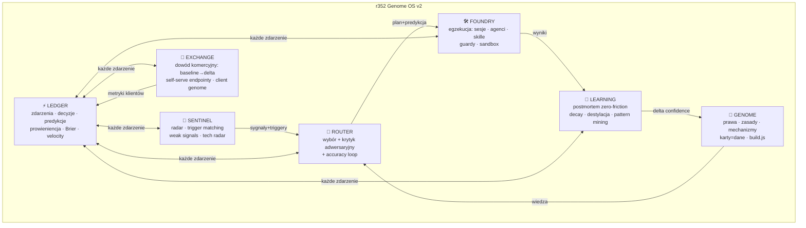
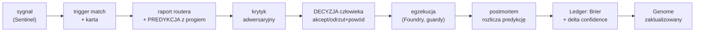
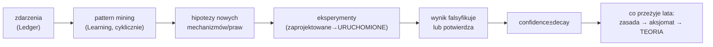

# r352 Genome OS v2 — specyfikacja następcy

**Data:** 08.08.2026 · **Autor:** CTO (następca, nie autor v1) · **Wejścia:** cały system v1, audyt Cognitive OS, panel 6 person, roadmapa 10 lat, feedback konsultanta.

---

## 0. Stanowisko następcy (spór z CEO — na Twoje własne żądanie)

Zanim architektura: trzy decyzje CEO, które kwestionuję, bo odpowiadam za wartość r352 za 10 lat, nie za potwierdzanie pomysłów.

**Spór 1: Kadencja meta-pracy.** To jest czwarta dyrektywa architektoniczna w ciągu 24 godzin — a licznik uczenia się systemu (Δ confidence z realnych projektów) wciąż wynosi **zero**. Panel powiedział to brutalnie: „sprzedaje się mapę kopalni, w której nie kopnięto łopatą". Prawo, na którym stoi cały ten system, mówi: **organizacja uczy się przez rozliczone decyzje, nie przez dokumenty** — więc każda kolejna godzina spec-pracy przy zerowym liczniku uczy nas DOKŁADNIE NICZEGO o tym, czy architektura działa. v2 poniżej jest świadomie ostatnim dokumentem tej serii: kolejna iteracja architektury ma prawo powstać dopiero po 5 rozliczonych postmortemach. Wpisuję to jako bramkę governance.

**Spór 2: „Więcej silników" to kierunek odwrotny do przewagi.** Z Twojej listy ~30 silników prawdziwych klas systemowych jest **siedem**. Reszta to albo warstwy tych siedmiu, albo funkcje przebrane za silniki, albo teatr nazewnictwa. System z 30 silnikami przy jednym użytkowniku umrze pod własnym ciężarem utrzymania — dokładnie tak, jak umarły Delegation (3225 linii na pustych danych) i gamifikacja w FOTRA. Projektuję v2 przez KONSOLIDACJĘ, nie mnożenie.

**Spór 3: Jednoczesna rola Benefitu jako 49% przychodu i głównego laboratorium metryk** to koncentracja ryzyka, którą system sam flaguje od pierwszego skanu, a każda kolejna decyzja ją pogłębia. v2 wymaga kontraktowo drugiego, niezależnego źródła dowodu (Sonova albo Archicom) ZANIM jakakolwiek publiczna narracja kategorii — to jest bramka, nie sugestia.

---

## 1. Teoria: prawa, z których wynika architektura

Nie funkcje — prawa. Każdy silnik v2 wynika z jednego z nich.

- **Prawo zdarzeń:** organizacja uczy się w tempie rejestrowanych i ROZLICZANYCH zdarzeń decyzyjnych, nie w tempie produkcji dokumentów. (Stąd: Ledger jako serce v2.)
- **Prawo kanału:** wiedza kompounduje tylko wtedy, gdy ma kanał ładowany automatycznie na start pracy — wiedza wymagająca przypomnienia umiera. (Potwierdzone empirycznie: auto-memory żyje, wiki umierają.)
- **Prawo granicy:** bezpieczna autonomia agentów rośnie proporcjonalnie do twardości granic (sandbox, read-only, jedna ścieżka promocji), a NIE do jakości modeli. (Stąd: governance jako właściwość każdego silnika, nie osobny moduł.)
- **Prawo kosztu dowodu:** AI obniża koszt wytworzenia falsyfikowalnego dowodu (demo, pomiar, back-test) szybciej niż koszt opinii — wygrywa organizacja o najniższym koszcie dowodu na decyzję. (Stąd: Exchange i rejestr predykcji.)
- **Prawo zastępowalności warstw:** modele i interfejsy tanieją i wymieniają się; korpusy zdarzeń, kalibracja i relacje drożeją. Inwestuj wyłącznie w warstwy drugiego rodzaju. (Zasada 10 lat w formie prawa.)

Kandydat na nowy aksjomat (do przyjęcia po pierwszych 10 postmortemach): **„Pewność jest długiem — każde 'proven' bez daty ostatniego potwierdzenia nalicza odsetki."**

---

## 2. Ocena modułów v1 (22 pozycje, skondensowana)

| Moduł | Po co istnieje | 10 lat? | AGI? | 1000 agentów? | Werdykt następcy |
|---|---|---|---|---|---|
| Genome (karty) | pamięć mechanizmów | TAK | TAK (korpus > model) | TAK | zostaje; wymaga frontmatter+build (F0) |
| Router | wybór przed egzekucją | TAK | TAK (selekcja zawsze potrzebna) | TAK (router = dyspozytor agentów) | zostaje; dodać krytyka i accuracy loop |
| Learning Engine | postmortem→confidence | TAK | TAK | TAK | istnieje jako rytuał, nie silnik — 0 przebiegów; zero-friction albo śmierć |
| Pulse | świadomość sytuacyjna | TAK | zmieni formę (rozmowa) | TAK | zostaje; z trigger matching staje się silnikiem Sentinel |
| Knowledge Graph | mapa relacji | częściowo | TAK jako dane, NIE jako kulki | TAK | dane zostają; force-layout to demo — wartość w zapytaniach, nie oglądaniu |
| Projects | projekt=eksperyment | TAK | TAK | TAK | zostaje; sekcja „zmiana Genome" pusta do czasu Ledgera |
| Client Genome | pamięć klienta | TAK | TAK | TAK | dziś atrapa (agregacja projektów); realna wersja = kompilacja z memory |
| Mechanisms | jednostka wiedzy | TAK | TAK | TAK | rdzeń IP; wymaga prowieniencji dowodów |
| Experiments | falsyfikacja | TAK | TAK | TAK | 22 zaprojektowane, 0 uruchomionych — moduł istnieje na papierze |
| CTO Dashboard | strategia | częściowo | — | — | statyczne kafle; zasili go Ledger albo skasować |
| Roadmap | sekwencja | TAK | — | — | jest (10LAT); zamrozić do 5 postmortemów |
| Architecture | rozdział silników | TAK | TAK | TAK | v2 poniżej |
| Prompt System | procedury w skillach | NIE w obecnej formie | ryzyko | ryzyko | KRYTYCZNE: prompty = niewersjonowane zachowanie cudzego modelu → specyfikacje we/wy w repo (F0.4) |
| Memory | auto-memory | TAK | TAK | wymaga przebudowy (append-only) | SPOF bez backupu — git NATYCHMIAST |
| Knowledge Compounding | kanał | TAK | TAK | TAK | działa dla wiedzy, NIE dla kodu (znany dług) |
| Automation | task CKO, croni | TAK | TAK | TAK | działa; rozszerzać przez Ledger |
| Agent Collaboration | workflow/subagenci | TAK | TAK | TO JEST przygotowanie na 1000 agentów | wzorce są (panel, ekstraktory); brak koordynacji przez dane — Ledger to da |
| Decision Systems | progi liczbowe | TAK | TAK | TAK | najgłębsze IP; walidatory wciąż promptami |
| Evaluation Systems | — | — | — | — | NIE ISTNIEJE (brak evals, baseline, Brier) — luka nr 1 |
| Benchmarking | Lighthouse itd. | TAK | TAK | TAK | punktowe; brak benchmarku samego systemu |
| Confidence | proven/emerging | w obecnej formie NIE | NIE | NIE | „miara częstości narracji" — dwupoziomowy + decay (F2) |
| Governance | zasady w promptach | częściowo | — | — | guardy zamiast dyscypliny (F1.4); governance = właściwość, nie moduł |

---

## 3. Architektura v2: SIEDEM silników (konsolidacja ~30)

**Mapowanie Twojej listy 30 → 7** (co wchłonęły):
- **LEDGER** ← Decision Engine, Prediction Engine, Evaluation Engine, Confidence, Learning Velocity Engine, Compounding Engine, Human Preference Engine (preferencje = historia decyzji), Organizational Health Engine.
- **GENOME** ← Principle Engine, Theory Engine (teoria = destylat Genome, nie osobny silnik), Axiom Layer, Capability/Skill Graph (skille w `.claude/` JUŻ są grafem zdolności — nie budować drugiego).
- **ROUTER** ← Reasoning Engine, Planning Engine (plan = wynik routingu), Simulation Engine w wersji minimalnej (pre-mortem z failure_conditions; pełna symulacja ODRZUCONA — patrz niżej).
- **LEARNING** ← Reflection Engine, Memory Compression Engine, Knowledge Distillation Engine, Pattern Mining Engine.
- **SENTINEL** ← Weak Signal Engine, Market Intelligence Engine, Opportunity Engine, Attention Engine, Context Engine (kontekst = memory+triggery, już jest).
- **FOUNDRY** ← Agent Coordination Engine, Automation, Governance Engine (guardy są właściwością Foundry, nie modułem).
- **EXCHANGE** ← Economic Engine, Relationship Engine, Narrative Engine (narracja kategorii = output Exchange, nie silnik).

**ODRZUCONE (nie przechodzą pytania „lepsze decyzje za 10 lat?"):** Simulation Engine jako pełny moduł (symulacja bez korpusu zdarzeń = generator fikcji z powagą naukowca), Vision Engine (wizja to praca CEO — outsourcing wizji do silnika jest anty-przewagą), osobny Narrative Engine (przedwczesny — patrz Spór 3), Organization Engine jako abstrakt (to suma pozostałych).

### Przepływ decyzji

### Przepływ uczenia

---

## 4. Top 50 rekomendacji (zwarte; ★ = nowe względem roadmapy 10 lat)

**NOW (1–14):** 1. events.jsonl (Ledger v0). 2. Frontmatter na kartach. 3. build.js bez AI. 4. Prompty→specyfikacje we/wy. 5. Git na memory (backup SPOF). 6. Decyzje klikalne w panelu→Ledger. 7. Trigger matching w tasku CKO. 8. Guard: projekt bez raportu routera = blokada. 9. Postmortem-zero-friction (szkic z git+sesji). 10. Predykcja z progiem w KAŻDYM raporcie routera ★. 11. Karta disproven dla gated-content. 12. Learning Velocity + Genome Diff na Dziś. 13. ★ Bramka meta-pracy: zero nowych dokumentów architektury do 5 postmortemów. 14. ★ Ledger schema z prowieniencją (pomiar/postmortem/narracja) od pierwszego wpisu.

**NEXT (15–34):** 15. Dwupoziomowy confidence+decay. 16. Krytyk adwersaryjny routera. 17. Router accuracy loop. 18. Brier score systemu. 19. Client Genome z memory (filtr prywatności). 20. White-space map z grafu. 21. Contradiction detector. 22. Experiment tracker (proposed→running→resolved). 23. Pre-mortem generator. 24. Promise ledger (obietnice z terminami). 25. Theory v0 (destylat praw). 26. ★ Eval harness: korpus 39 briefów jako stały zbiór testowy każdej zmiany scoringu. 27. ★ Pattern mining kwartalny na Ledgerze. 28. Market intelligence archiwum. 29. AI reflections w raporcie CKO. 30. ★ Sesyjny protokół delta (każda sesja kończy wpisem do Ledgera). 31. Baseline→delta umownie u klienta #2. 32. Self-serve alignment endpoint. 33. ★ „Decision replay": możliwość odtworzenia dlaczego-tak-zdecydowano z Ledgera (audytowalność=produkt). 34. Cost-of-delay na kolejce.

**LATER (35–44):** 35. Prediction layer na własnych danych. 36. Genome MCP server (agenci klientów pytają Genome). 37. Genome-per-klient jako produkt. 38. Briefing głosowy. 39. Autonomous experiment runner. 40. ★ Federacja Ledgerów klienckich (anonimizowane benchmarki między klientami — moat dekady). 41. ★ Organizational Health Index z Ledgera jako produkt raportowy. 42. Multi-agent koordynacja przez Ledger (agenci czytają/piszą zdarzenia, nie rozmawiają). 43. ★ Sukcesja: system operacyjny bez Przemka przez 30 dni jako test (bus factor). 44. ★ Wymienny runtime: raz na kwartał przebieg procedur na innym modelu (test Prawa zastępowalności).

**ODRZUCONE JAWNIE (45–50):** 45. Wektorowa baza dla 22 kart (grep+frontmatter wystarczy do ~500 kart). 46. Zewnętrzny framework agentowy (LangChain itd. — własne wzorce są prostsze i już działają). 47. Fine-tuning modelu na korpusie (za mały korpus; kalibracja > personalizacja). 48. Pełny Simulation Engine (fikcja z powagą). 49. Publiczny launch kategorii przed 2 case'ami (Spór 3). 50. Kolejny redesign UI przed F0-F2 (interfejs jest wystarczający; wąskim gardłem są dane i pętla).

---

## 5. Roadmapy

**24 miesiące (kwartalnie):**
- **Q3'26:** F0+F1 (Ledger, build, guardy, pętla decyzji) + 5 postmortemów + ARToffNIA/Kubota/framework wysłane. Miara: Δ confidence > 0, Brier liczony.
- **Q4'26:** F2 (epistemika) + pilot Brief Governance na Beneficie z baseline→delta + klient #2 umownie. Miara: pierwsza płatność za governance.
- **Q1'27:** self-serve alignment endpoint + 2. case z metrykami. Miara: przychód bez godzin Przemka > 0.
- **Q2'27:** publiczna narracja kategorii (dopiero teraz) + Theory v1. Miara: inbound z kategorii.
- **Rok 2:** federacja benchmarków (≥3 klientów), Genome MCP, produkt Organizational Health; miara: 30% przychodu bez godzin właściciela; test sukcesji 30 dni.

**10 lat (horyzonty):** H1 (1–2 lata): najlepiej skalibrowany system decyzyjny jednej firmy kreatywnej w PL — przewaga = korpus. H2 (3–5): Genome-per-klient + federacja — przewaga = sieć danych między klientami, nie do odtworzenia przez wejście z zewnątrz. H3 (5–10): teoria działania organizacji marketingowych w erze AI z dowodami z setek wdrożeń — przewaga = standard, który inni muszą cytować. Na każdym horyzoncie: modele i UI wymienialne, Ledger+Genome+relacje wieczne.

## 6. Technologie

**Obserwować:** protokoły agent-to-agent i pamięci agentowej, standardy MCP (registry, auth), modele lokalne (test wymienności runtime), computer-use (domknie ostatnią milę agent-as-runtime), structured-output evals.
**Wdrożyć:** frontmatter+JSONL+git (już), MCP server dla Genome (LATER), eval harness na własnym korpusie, cron/launchd dla wszystkiego deterministycznego.
**NIE wdrażać:** wektorowe bazy (na tę skalę), obce frameworki agentowe, fine-tuning, blockchain/tokeny, kubernetes/mikroserwisy, SaaS-owa infrastruktura przed pierwszym klientem self-serve.

## 7. Ryzyka · Szanse · Moaty

**Ryzyka architektoniczne:** (1) pojedynczy runtime (Claude) — mitygacja: rekomendacja 44; (2) meta-praca wypiera dowód — mitygacja: bramka 13; (3) koncentracja Benefit — mitygacja: bramka klient #2; (4) pewność nienaliczająca odsetek (confidence bez decay) — F2; (5) bus factor 1 — rekomendacja 43.
**Szanse:** okno 12–18 mies. zanim wielcy zagospodarują „governance kreacji"; korpus briefów wolumenowego klienta jako niekupowalny zbiór kalibracyjny; AI obniża koszt dowodu — Prawo kosztu dowodu gra dla małych.
**Najbardziej defensywne elementy (kolejność):** 1. Ledger zdarzeń z prowieniencją (niekopiowalne z definicji). 2. Kalibracja (Brier na własnym korpusie). 3. Karty mechanizmów z rozliczonymi dowodami. 4. Relacje+Client Genome. 5. Teoria z dowodami. Wszystko inne — kod, UI, prompty, modele — jest wymienialne i NIE jest moatem.

---

## 8. Definicja ukończenia v2

v2 NIE jest ukończone, gdy powstaną dokumenty. v2 jest ukończone, gdy: Ledger ma ≥100 zdarzeń z prowieniencją · ≥5 postmortemów rozliczyło predykcje · Brier score istnieje · ≥1 klient ma baseline→delta umownie · Δ confidence z projektów ≥ 10 · żaden projekt nie wystartował bez routera (guard, nie dyscyplina). Do tego czasu obowiązuje bramka z rekomendacji 13: **żadnych nowych dokumentów architektury.**
