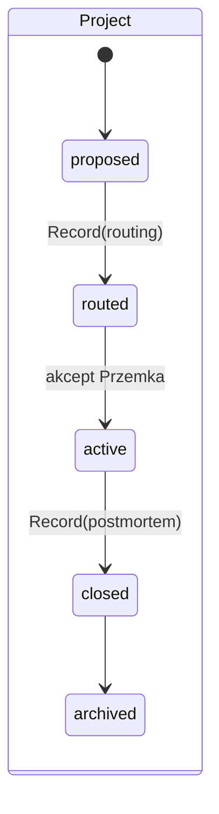
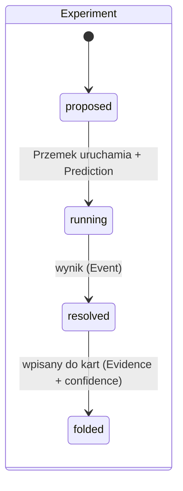
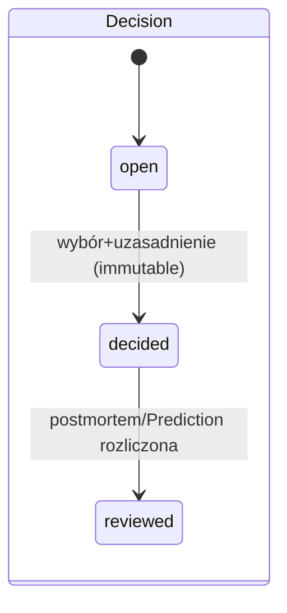

# Genome OS — Data Foundation (F-1 / F0)

**Data:** 08.08.2026 · **Status: CZĘŚĆ A APPROVED WITH CHANGES (decyzja CEO 08.08, dec:2026-08-08-data-foundation) — 4 korekty wprowadzone. B–D zatwierdzone do implementacji.**
Struktura dokumentu odpowiada zleceniu: **Część A = Ontologia (Etap 1, do zatwierdzenia jako pierwsza)**; Części B–D (model danych, struktura, build) są projektem WARUNKOWYM — obowiązują dopiero po akceptacji A i mogą się zmienić, jeśli A się zmieni.

---

# CZĘŚĆ A — ONTOLOGIA (Etap 1)

## A.0 Dwie natury obiektów — fundament całości

Każdy obiekt systemu należy do jednej z dwóch natur i to rozstrzyga wszystko dalej:

- **WIEDZA (mutable, wersjonowana):** opisuje, co system wie i umie. Zmienia się — ale każda zmiana zostawia wpis w historii wersji ORAZ zdarzenie w Ledgerze. Żyje jako pliki markdown z frontmatter.
- **FAKTY (immutable, append-only):** opisują, co się wydarzyło. Nigdy nie są edytowane ani kasowane — błędny fakt koryguje się NOWYM faktem, który go unieważnia. Żyją jako wpisy JSONL w Ledgerze (+ ewentualny dokument w records/).

Zasada nadrzędna (z Prawa zdarzeń): **stan wiedzy wolno zmienić wyłącznie w konsekwencji faktu.** Doprecyzowanie CEO: „fakt" obejmuje też zdarzenia WEWNĘTRZNE — refaktor, korektę błędu, zmianę definicji — ale każde MUSI wygenerować jawny event (`knowledge.corrected`, `knowledge.reclassified`, `ontology.changed`). Nawet administrator nie może po cichu poprawić rzeczywistości. Zmiana confidence bez zdarzenia-przyczyny = błąd buildu.

## A.1 Katalog obiektów (19)

### Warstwa wiedzy (mutable)

| Obiekt | Definicja | Odpowiedzialność (za co odpowiada w systemie) | Kluczowe relacje | Cykl życia | Właściciel zmian | Natura |
|---|---|---|---|---|---|---|
| **Axiom** | Fundamentalne prawo, którego nie dowodzimy w każdym projekcie — na nim budujemy | Spójność wszystkich zasad; ostatnia instancja przy konfliktach | ← derives (Principle) | draft → accepted → (deprecated); bramka zmiany ZNACZNIE wyższa niż Mechanism (dowody z wielu projektów + Decision + event ontology.changed) | Przemek (wyłącznie) | wiedza |
| **Principle** | Uniwersalna zasada działania organizacji; abstrakcja nad mechanizmami | Grupowanie mechanizmów; test „nowy mechanizm musi wskazać zasadę" | derives → Axiom · ← implements (Mechanism) | draft → active → (deprecated) | Przemek po propozycji sesji | wiedza |
| **Mechanism** | Powtarzalny generator rezultatu („X powoduje Y, bo Z") — jednostka wiedzy operacyjnej | Rdzeń IP; wejście Routera; nośnik confidence i dowodów | implements → Principle · evidences ↔ Project (przez Evidence) · related ↔ Mechanism · tested_by ← Experiment | hypothesis → emerging → validated → (disproven \| deprecated); przejścia TYLKO przez Event | sesja z postmortemu; Przemek przy disproven/deprecated | wiedza |
| **Workflow** | Nazwana sekwencja kroków z bramkami, orkiestrująca mechanizmy w konkretnym procesie (np. F1–F5, audyt UX) | Powtarzalność procesu wielokrokowego; miejsca checkpointów i bramek | uses → Mechanism[] · gated_by → Benchmark[] | draft → active → deprecated | Przemek | wiedza |
| **SOP** | Odtwarzalna procedura wykonawcza jednej czynności (destylat sesji: publikacja Medium, rozliczenie Ady) | Wykonanie bez odkrywania od nowa; delegowalność | belongs_to → Workflow? · executes ← Agent | draft → active → superseded (przez kod/Guard) | sesja; Przemek zatwierdza | wiedza |
| **Rule** | Twarda norma zachowania („Trello read-only", „wegobold małą literą") | Granice bezpieczeństwa i stylu; źródło guardów | enforced_by ← Guard · scope → Client\|global | active → retired | Przemek (wyłącznie) | wiedza |
| **Guard** | WYKONYWALNA egzekucja Rule (check w build/CI/prompcie taska, który BLOKUJE) | Zamiana dyscypliny w maszynę; incydent → guard | enforces → Rule · born_from → Event (incydent) | proposed → armed → retired | sesja proponuje, Przemek zbraja | wiedza |
| **Benchmark** | Nazwana metryka z progiem i kontekstem (Critic ≥750, Lighthouse 100, Brand Lock ≥85) | Obiektywizacja jakości; warunek bramek | used_by ← Workflow/Experiment/Prediction | draft → calibrated → active → deprecated | Przemek po kalibracji na danych | wiedza |
| **Capability** | Zdolność systemu: skill, narzędzie, integracja, dostęp (ux-domain-audit, Gmail MCP, Phantom-Browser) | Inwentarz tego, CZYM system umie działać; graf zdolności | used_by ← Agent · requires → Capability? | available → degraded → retired | sesja CKO (inwentarz), Przemek (dostępy) | wiedza |
| **Agent** | Skonfigurowany wykonawca: task cykliczny, subagent, persona (r352-cko-daily, ekstraktory, panel person) | Kto/co wykonuje pracę; rozliczalność wykonania | uses → Capability[] · runs → SOP/Workflow | defined → active → retired | Przemek definiuje, sesje uruchamiają | wiedza |
| **Component** | Reużywalny artefakt kodu/designu (szablon CMS, mini-SSG, silnik grafu, dashboard-starter) | Kompoundowanie KODU (znany dług: dziś kompounduje tylko wiedza) | born_from → Project · used_by → Project[] | extracted → active → superseded | sesja ekstrahuje, Przemek kanonizuje | wiedza |
| **Client** | Organizacja, z którą pracujemy; nośnik własnego genomu (preferencje, decyzje, styl) | Kontekst wszystkich projektów; przyszły produkt (Client Genome) | ← for (Project) · scoped_rules → Rule[] | prospect → active → dormant → archived | Przemek; genom akreuje z Events | wiedza |

### Warstwa faktów (immutable) + obiekty operacyjne

| Obiekt | Definicja | Odpowiedzialność | Kluczowe relacje | Cykl życia | Właściciel | Natura |
|---|---|---|---|---|---|---|
| **Project** | Ograniczone w czasie przedsięwzięcie = eksperyment na rzeczywistości | Laboratorium; jedyne źródło zmian confidence | for → Client · routed_by → Record(routing) · closed_by → Record(postmortem) · uses → Mechanism[] · produced → Component[] | proposed → routed → active → closed → archived; **guard: active wymaga routed; closed wymaga postmortem** | Przemek (przejścia), sesje (treść) | operacyjny (stan mutable, historia w Events) |
| **Decision** | Jednostka pracy właściciela: kontekst → opcje → wybór → uzasadnienie | Korpus decyzyjny; kalibracja systemu do właściciela | in → Project? · informed_by → Mechanism[]/Evidence[] · predicted_by ← Prediction | open → decided → reviewed; **po `decided` NIEZMIENNA — korekta = nowa Decision z supersedes** | Przemek (wybór), sesja (rejestracja) | FAKT po decided |
| **Prediction** | Falsyfikowalna prognoza zarejestrowana PRZED wynikiem: metryka, próg, termin, stawiający | Uczciwość epistemiczna; wejście do Brier score | about → Decision\|Experiment\|Project · resolved_by → Event | registered → resolved(hit\|miss\|void); **immutable od rejestracji** | sesja rejestruje (router/eksperyment), Event rozlicza | FAKT |
| **Experiment** | Zaprojektowany test mechanizmu na kliencie-laboratorium z określonym „czego się dowiemy" | Falsyfikacja; jedyna droga hypothesis→proven poza postmortem | tests → Mechanism · on → Client · registers → Prediction | proposed → running → resolved(confirmed\|refuted\|inconclusive) → folded (wynik wpisany do kart) | Przemek uruchamia, sesja prowadzi | operacyjny; wynik = FAKT |
| **Evidence** | Pojedynczy dowód wiążący Mechanism↔Project: typ {pomiar\|postmortem\|narracja}, data, źródło, treść | Prowieniencja pewności; rozróżnienie zmierzone/opowiedziane | links Mechanism ↔ Project · via → Record? | append-only; **immutable**; unieważnienie = Event `evidence.retracted` | sesja z postmortemu/pomiaru | FAKT |
| **Signal** | Sygnał wymagający ZBADANIA, z cyklem życia i ścieżką Signal→Hypothesis→Prediction→Evidence→Mechanism update. Zwykłe powiadomienie NIE jest Signalem — jest Eventem (CEO: nie tworzymy dwóch nazw na to samo) | Wejście Sentinela; kolejka „czeka na Ciebie" | matches → Mechanism? · about → Client? · resolves_to → Decision? | observed → investigated → linked(→Decision/Experiment/Mechanism) \| dismissed | task CKO tworzy, Przemek rozstrzyga | operacyjny (stan), historia = Events |
| **Record** | Immutable dokument procesowy: raport routera, postmortem, audyt, panel, raport CKO | Pełna treść faktów zbyt duża na Event; audytowalność | attached_to → Project/Decision/… | created → (superseded) — bez edycji | proces, który go wytworzył | FAKT |
| **Event** | Atomowy fakt w Ledgerze: kto/co/kiedy/dlaczego + typ + payload + prowieniencja | JEDYNY nośnik historii; źródło velocity, Brier, diff, replay | on → dowolny obiekt (id) · caused_by → Event? | append-only; korekta = event korygujący | każdy proces piszący; NIGDY edycja | FAKT |

## A.2 Cykle życia — trzy kluczowe (diagramy)





## A.3 Niezmienniki ontologii (build je egzekwuje)

1. Każdy **Mechanism** wskazuje dokładnie jeden **Principle**; każdy Principle wskazuje ≥1 Axiom.
2. **`validated` wymaga ≥3 NIEZALEŻNYCH Evidence z ≥2 różnych projektów, w tym ≥1 typu `measurement` lub rozliczony `postmortem`** — sama `narracja` nie daje validated. Termin `proven` USUNIĘTY (CEO: „proven sugeruje prawdę zamkniętą; przy decay nic nie jest udowodnione na zawsze"). Karty niespełniające → downgrade do emerging przy pierwszym buildzie, bez wyjątków.
3. Zmiana `confidence` bez odpowiadającego Eventu = błąd buildu.
4. Project `active` bez Record(routing) = błąd; `closed` bez Record(postmortem) = błąd.
5. Prediction bez terminu lub progu liczbowego = błąd rejestracji.
6. Każda relacja wskazuje istniejący obiekt (integralność referencyjna).
7. Fakty są append-only: build wykrywa modyfikację historycznych linii Ledgera (hash łańcuchowy per plik miesięczny).
8. **No evidence without provenance:** każdy Evidence wskazuje konkretne źródło (record / measurement / postmortem / decision / external source). `source: "analysis"` jest NIELEGALNE.
9. **No prediction without resolution:** Prediction bez przewidywanej wartości/zdarzenia, deadline'u ORAZ kryterium sukcesu/porażki nie przechodzi do `registered` — inaczej Brier jest niepoliczalny.
10. **No confidence double-counting:** ten sam Evidence ID podnosi confidence danego mechanizmu najwyżej RAZ, niezależnie od liczby dokumentów i relacji.

---

# CZĘŚĆ B — MODEL DANYCH (Etap 2, warunkowy)

## B.1 Zasada: obiekt = plik

- Wiedza + obiekty operacyjne → **markdown z YAML frontmatter** (frontmatter = dane maszynowe, proza pod spodem = treść dla ludzi i LLM).
- Fakty → **JSONL w Ledgerze** (Event, Prediction, Evidence jako typy wpisów) + **Record** jako plik md (immutable, z frontmatter).

## B.2 Frontmatter — pola wspólne (każdy plik md)

```yaml
id: mech:numeric-gates          # globalnie unikalne: <typ>:<slug>
type: mechanism                  # typ z rejestru ontology/types.json (rozszerzalnego)
title: "Numeric Gates"
status: emerging                 # ze słownika cyklu życia SWOJEGO typu
created: 2026-08-07
updated: 2026-08-08
version: 2                       # int; historia wersji = sekcja "## Version" w prozie + Events
owner: przemek | session | task  # kto ma prawo zmieniać
relations:                       # WYŁĄCZNIE typowane krawędzie ze słownika (B.4)
  implements: [prin:reduce-subjectivity]
  related: [mech:deterministic-spine, mech:machine-narrows-human-picks]
tags: []                         # wolne, niesemantyczne
```

## B.3 Pola specyficzne (najważniejsze typy)

**Mechanism:** `confidence:` obiekt dwupoziomowy — `{ value: validated, evidence_strength: { n: 5, projects: 4, types: {pomiar: 1, postmortem: 1, narracja: 3}, last_confirmed: 2026-08-07 }, recommendation: use|use-with-care|test-first }`; pola karty (trigger, context, anti_context, inputs, ai_tasks, human_tasks, expected_outcome, experiment) jako klucze frontmatter (listy/stringi), proza = uzasadnienia.
**Project:** `client: cli:benefit`, `domain:`, `routing: rec:routing/...`, `postmortem: rec:postmortems/...`, `mechanisms_planned: []`, `mechanisms_confirmed: []`.
**Decision:** `question:`, `options: []`, `choice:`, `rationale:`, `decided: 2026-08-08`, `supersedes: dec:...?`.
**Guard:** `enforces: rule:trello-read-only`, `implementation: opis-gdzie-wpięty` (kod przyjdzie w implementacji, spec tylko opisuje).
**Client:** `revenue_share_note:` (bez kwot w plain — polityka prywatności), `hard_rules: [rule:...]`, `labs: true|false`.

## B.4 Słownik relacji (zamknięty — nowa relacja wymaga zmiany tej specyfikacji)

| Relacja | Z → Do | Odwrotność | Krotność |
|---|---|---|---|
| derives | Principle → Axiom | grounded_by | N:1..n |
| implements | Mechanism → Principle | implemented_by | N:1 |
| related | Mechanism ↔ Mechanism | (symetryczna) | N:M |
| tests | Experiment → Mechanism | tested_by | N:1 |
| uses | Workflow/Agent/Project → Mechanism/Capability/Component | used_by | N:M |
| enforces | Guard → Rule | enforced_by | N:1 |
| for | Project → Client | projects | N:1 |
| evidences | Evidence(Ledger) → Mechanism + Project | — | fakt |
| about / on | Prediction/Signal/Event → dowolny id | — | fakt |
| attached_to | Record → Project/Decision/... | records | N:1 |
| supersedes | Decision/Component → ten sam typ | superseded_by | 1:1 |
| born_from | Guard/Component → Event/Project | — | N:1 |

## B.5 Ledger — format wpisu (JSONL, jedna linia = jeden fakt)

```json
{"id":"evt:2026-08-08-0012","ts":"2026-08-08T09:15:00+02:00","kind":"confidence.changed",
 "on":"mech:presale-demand-ledger","from":"emerging","to":"validated",
 "cause":"rec:postmortems/fitstyle-faza-b-2026-09-30","actor":"session:postmortem",
 "provenance":"postmortem","note":"konwersja listy 11% > próg 8%","prev_hash":"..."}
```
Przestrzeń nazw `kind` (zamknięta, rozszerzana przez tę specyfikację): `project.*` (proposed|routed|activated|closed) · `decision.*` (opened|decided|reviewed) · `prediction.*` (registered|resolved) · `evidence.*` (added|retracted) · `confidence.changed` · `knowledge.corrected` · `knowledge.reclassified` · `ontology.changed` · `signal.*` (observed|investigated|linked|dismissed) · `experiment.*` · `guard.*` (proposed|armed|fired) · `recommendation.*` (issued|accepted|rejected|done) · `object.*` (created|updated|deprecated).

---

# CZĘŚĆ C — STRUKTURA I NAZEWNICTWO (Etap 2 cd.)

## C.1 Struktura folderów (docelowa)

```
r352-os/genome/
├── ontology/            # ta specyfikacja + przyszłe wersje (immutable po akceptacji, nowa wersja = nowy plik)
├── axioms/  principles/  mechanisms/  workflows/  sops/  rules/  guards/
├── benchmarks/  capabilities/  agents/  components/
├── clients/  projects/  experiments/  decisions/  signals/
├── ledger/              # events-2026-08.jsonl (partycja miesięczna, append-only, hash łańcuchowy)
├── records/             # routing/  postmortems/  audits/  reviews/ (immutable dokumenty)
└── dist/                # WYŁĄCZNIE wyjścia buildu: INDEX.md, genome-data.js, graph.json (commitowane, nigdy edytowane ręcznie)
```
Migracja z v1 (jednorazowa, częścią implementacji F0): `mechanisms/*.md` → frontmatter; `AKSJOMATY.md` → `axioms/` (1 plik = 1 aksjomat); `PRINCIPLES.md` → `principles/`; `routing/`, `postmortems/` → `records/`; dokumenty analityczne (audyty, panel, roadmapy, v2) → `records/reviews/`.

## C.2 Konwencje nazewnicze

- Plik = `<slug>.md`, slug kebab-case ASCII (bez polskich znaków), stały na zawsze (zmiana nazwy = deprecated + nowy obiekt z supersedes).
- ID = `<prefiks-typu>:<slug>`; prefiksy: `ax prin mech wf sop rule guard bench cap agent comp cli proj exp dec sig rec evt`.
- Records: `records/<kategoria>/<slug>-YYYY-MM-DD.md`. Eventy: id `evt:YYYY-MM-DD-NNNN` (sekwencja dzienna).
- Daty wyłącznie ISO 8601; strefa jawna w Ledgerze.
- Język: treść po polsku; nazwy mechanizmów/zasad po angielsku (brandowalne); klucze frontmatter po angielsku.

---

# CZĘŚĆ D — BUILD SYSTEM (Etap 3, warunkowy — specyfikacja, bez kodu)

**Jedno narzędzie: `build.js` (Node, zero zależności, zero AI, zero sieci, zero logiki biznesowej).** Deterministyczny: identyczne wejście → bajtowo identyczne wyjście (żadnych timestampów buildu; „data stanu" = ts ostatniego eventu).

Fazy: **(1) READ** — wczytaj wszystkie md (frontmatter+proza) i JSONL. **(2) VALIDATE** — schemat per typ (pola wymagane, słowniki statusów), integralność referencyjna relacji, niezmienniki ontologii A.3 (w tym reguła proven, spójność confidence↔Events, append-only Ledgera przez hashe), konwencje nazw. Błąd = niezerowy exit code + raport listą (plik:linia:problem). **(3) INDEX** — `dist/INDEX.md` (spis per typ z licznikami — liczniki są WYŁĄCZNIE liczone, nigdy wpisywane ręcznie; koniec klasy błędów „12 vs 16"). **(4) EMIT** — `dist/genome-data.js` (window.GENOME_DATA dla viewera) i `dist/graph.json` (węzły+typowane krawędzie z relacji). Tryby: `build` (pełny), `build --check` (tylko walidacja — do guarda pre-commit i taska CKO). AI pisze karty; build NIGDY nie pisze kart, karty NIGDY nie są pisane przez build — granica jednokierunkowa.

---

# Do akceptacji

1. **Część A (ontologia):** 19 obiektów, podział wiedza/fakty, niezmienniki A.3 — w szczególności zaostrzona reguła `proven` (spowoduje jednorazowy, jawny downgrade części dzisiejszych 16 kart proven do emerging — to jest cena uczciwości epistemicznej i rekomenduję ją zapłacić).
2. Po akceptacji A: potwierdzenie B–D (albo poprawki) → dopiero wtedy implementacja: migracja plików + build.js + pierwsze wpisy Ledgera.

---

## Rozszerzalność ontologii (korekta z 15.08.2026)

Wcześniejsze brzmienie tego dokumentu traktowało listę typów jako zamkniętą, a skille
egzekwowały zasadę „ontologii nie rozszerzasz". **Zasada została zniesiona jako błędna**
(`dec:2026-08-15-rozszerzalna-ontologia`). Blokowanie elementu, który jest zdecydowanym
ulepszeniem, jest błędem — system ma rosnąć mądrze, nie stać w miejscu.

Prawdziwym ryzykiem nie było rozszerzanie, tylko **duplikacja rejestru**: lista typów żyła
w trzech ręcznie utrzymywanych kopiach (`build.js`, `ingest.js`, widok Grafu). Rejestr jest
teraz jeden — `ontology/types.json` — i to on, a nie ten dokument, jest źródłem prawdy
o typach, ich katalogach, prefiksach i cyklach życia.

Dodanie typu przechodzi przez bramkę `rule:rozszerzanie-ontologii`: cztery pytania na piśmie,
bez zgody i bez czekania, plus prawo do cofnięcia po 90 dniach. Historia rozszerzeń jest
zapisana w polu `added[]` rejestru.

Pierwszym typem dodanym po zniesieniu zakazu jest `council` (15.08.2026).
